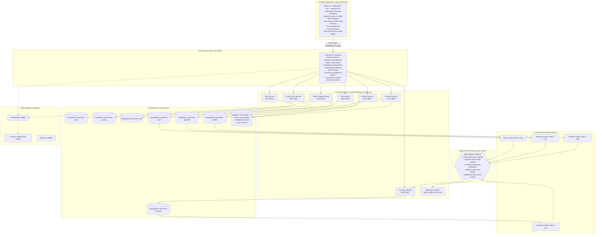
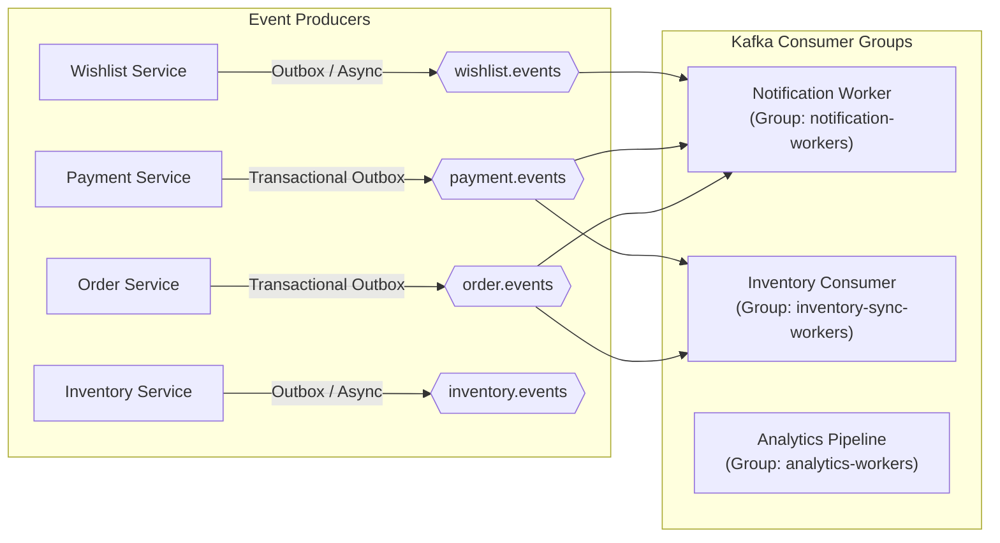
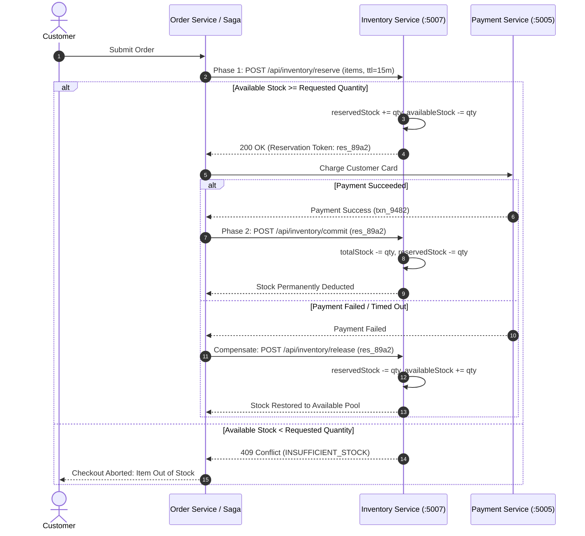
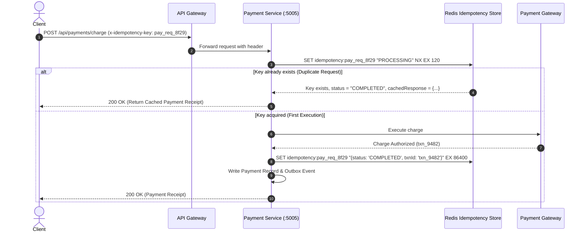
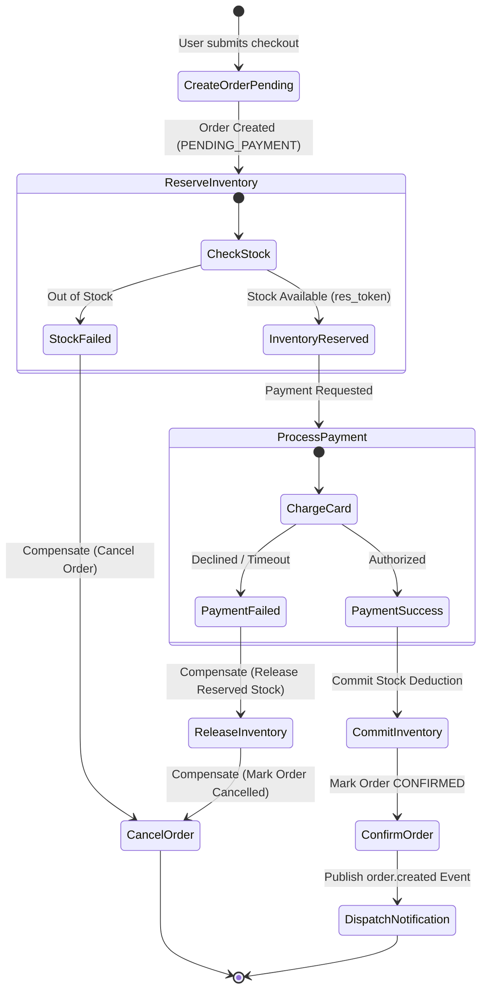
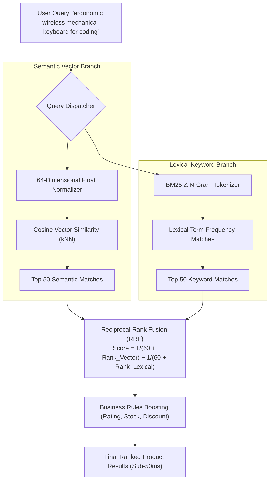

# Enterprise Distributed E-Commerce & Marketplace Platform (NovaCommerce)

[](https://nodejs.org/)
[](https://react.dev/)
[](https://kafka.apache.org/)
[](https://redis.io/)
[](https://www.mongodb.com/)
[](https://opentelemetry.io/)
[](https://prometheus.io/)
[](https://grafana.com/)
[](https://www.docker.com/)
[](https://kubernetes.io/)
[](http://localhost:5000/docs)
[](LICENSE)

An enterprise-grade, event-driven distributed multi-vendor marketplace platform engineered with Node.js microservices, Apache Kafka (KRaft mode), Redis distributed caching, MongoDB Database-per-Service isolation, OpenTelemetry distributed tracing, Prometheus & Grafana telemetry, Docker, Kubernetes, and an AI-powered shopping & recommendation platform, fronted by a React 19 TypeScript application.

---

## 📑 Table of Contents
1. [Platform Overview & Executive Summary](#platform-overview--executive-summary)
2. [Complete System Architecture Topology](#complete-system-architecture-topology)
3. [Core Distributed Systems & Reliability Engineering](#core-distributed-systems--reliability-engineering)
   - [Event-Driven Architecture (Apache Kafka KRaft)](#1-event-driven-architecture-apache-kafka-kraft)
   - [Dedicated Inventory Service (Two-Phase Locking)](#2-dedicated-inventory-service-two-phase-locking)
   - [Payment Service & Idempotency Key Architecture](#3-payment-service--idempotency-key-architecture)
   - [Wishlist & Saved Items Microservice](#4-wishlist--saved-items-microservice)
   - [Distributed Transactions: Saga Pattern & Compensation](#5-distributed-transactions-saga-pattern--compensation)
   - [Transactional Outbox Pattern (Dual-Write Prevention)](#6-transactional-outbox-pattern-dual-write-prevention)
   - [Deterministic Order State Machine](#7-deterministic-order-state-machine)
   - [Fault Tolerance: Circuit Breakers, Retries & Dead Letter Queues (DLQ)](#8-fault-tolerance-circuit-breakers-retries--dead-letter-queues-dlq)
   - [Advanced Redis Infrastructure](#9-advanced-redis-infrastructure)
4. [AI, Search & Marketplace Innovations](#ai-search--marketplace-innovations)
   - [AI Semantic Vector Search & Hybrid Ranking (RRF)](#10-ai-semantic-vector-search--hybrid-ranking-rrf)
   - [Real-Time Recommendation Engine (with Wishlist Intent Weighting)](#11-real-time-recommendation-engine-with-wishlist-intent-weighting)
   - [Conversational AI Shopping Assistant](#12-conversational-ai-shopping-assistant)
   - [Real-Time Multi-Factor Fraud Risk Engine](#13-real-time-multi-factor-fraud-risk-engine)
   - [Multi-Seller Marketplace Architecture & Buy-Box Algorithm](#14-multi-seller-marketplace-architecture--buy-box-algorithm)
5. [Observability, Security & DevOps Engineering](#observability-security--devops-engineering)
   - [OpenTelemetry Distributed Tracing & W3C Propagation](#15-opentelemetry-distributed-tracing--w3c-propagation)
   - [Prometheus Metrics & Pre-Configured Grafana Dashboards](#16-prometheus-metrics--pre-configured-grafana-dashboards)
   - [Centralized Structured JSON Logging](#17-centralized-structured-json-logging)
   - [Docker & Kubernetes Cloud-Native Orchestration](#18-docker--kubernetes-cloud-native-orchestration)
   - [Automated CI/CD Pipeline](#19-automated-cicd-pipeline)
   - [Security Hardening & OWASP Compliance](#20-security-hardening--owasp-compliance)
6. [12-Phase Implementation Roadmap & Status Matrix (100% Completed)](#12-phase-implementation-roadmap--status-matrix-100-completed)
7. [Repository Structure & Database Architecture](#repository-structure--database-architecture)
8. [Unified API Specifications](#unified-api-specifications)
9. [Local Development & Deployment Guide](#local-development--deployment-guide)
10. [Architecture Decision Records (ADRs)](#architecture-decision-records-adrs)

---

## Platform Overview & Executive Summary

NovaCommerce is an enterprise distributed marketplace system designed to demonstrate high availability, eventual consistency across isolated microservices, asynchronous decoupling, resilient failover mechanisms, deep observability, and production AI search integrations.

### Key Architecture Highlights
* **Strict Database-per-Service Isolation**: 8 standalone services each owning independent MongoDB databases and Redis caches with zero cross-database coupling.
* **Apache Kafka KRaft Event Backbone**: Asynchronous event streams for order lifecycles, stock adjustments, payment updates, price drops, and email alerts with partition ordering.
* **Distributed Consistency (Saga & Outbox)**: Orchestrated forward execution and backward compensating rollbacks coordinated with Transactional Outbox CDC publishers.
* **Resilience Engineering**: Stateful Circuit Breakers (fail-fast within 1ms during degradation), exponential backoff retries with jitter, and Dead Letter Queues (DLQ).
* **AI Search & Shopping Intelligence**: 64-dimensional float dense embeddings with Cosine similarity, Reciprocal Rank Fusion (RRF) hybrid search, multi-signal behavioral intent personalization, conversational shopping concierge, and real-time checkout fraud risk scoring.
* **Full-Stack Observability**: W3C `traceparent` distributed tracing across HTTP and Kafka boundaries, Prometheus metrics scraping, and Grafana telemetry dashboards.
* **Cloud-Native Deployment**: Multi-stage Docker builds, Kubernetes manifests (Deployments, Services, ConfigMaps, Secrets, Ingress, HPA autoscaling), and GitHub Actions CI/CD workflows.

---

## Complete System Architecture Topology



---

## Core Distributed Systems & Reliability Engineering

### 1. Event-Driven Architecture (Apache Kafka KRaft)
Direct point-to-point synchronous REST dependencies create cascade failures and latency amplification. Apache Kafka acts as our high-throughput asynchronous backbone in ZooKeeper-less KRaft mode:



#### Core Kafka Topics & Partition Keys
* `order.events` (Partitions: 3) — Partition Key: `orderId` (ensures sequential order state delivery).
* `payment.events` (Partitions: 3) — Partition Key: `orderId`.
* `inventory.events` (Partitions: 3) — Partition Key: `productId`.
* `wishlist.events` (Partitions: 3) — Partition Key: `userId`.
* `notification.events` (Partitions: 3) — Partition Key: `userId`.

---

### 2. Dedicated Inventory Service (Two-Phase Locking)
Instead of a primitive mutable stock integer, the dedicated **Inventory Service (`:5007`)** implements explicit two-phase stock locking semantics with TTL expiration:



---

### 3. Payment Service & Idempotency Key Architecture
Prevents double-charging customers during network disconnections, browser double-clicks, or automated retries:



---

### 4. Wishlist & Saved Items Microservice
The dedicated **Wishlist Service (`:5006`)** manages user aspirational intent, price tracking, and social sharing:
* **1-Click Move-to-Cart**: Atomically transfers saved items into the active cart without client-side race conditions.
* **Price Drop Detection & Alerting**: Compares current product prices against `priceAtAdd`, automatically publishing `wishlist.price_dropped` events to notify customers.
* **Public Shared Gift Registries**: Generates secure, unguessable UUID share tokens (`/api/wishlist/shared/:shareToken`) allowing public read-only viewing.

---

### 5. Distributed Transactions: Saga Pattern & Compensation
Coordinated by `OrderSagaOrchestrator` in `order-service` to manage forward transactions and backward compensations without distributed locks:



---

### 6. Transactional Outbox Pattern (Dual-Write Prevention)
Eliminates message loss and phantom state discrepancies when database commits succeed but Kafka broker network calls fail:
1. **Atomic Local Transaction**: The service writes the business entity (e.g. `Order`, `Payment`) and the `OutboxMessage` (`status: UNPUBLISHED`) inside a single local MongoDB transaction.
2. **Asynchronous Polling Worker**: A background CDC poller selects unpublished events, dispatches them to Kafka, and marks them `status: PUBLISHED` upon receiving the broker ACK.

---

### 7. Deterministic Order State Machine
Enforces strict unidirectional lifecycle progression, preventing illegal state mutations:

```text
[CREATED] ──► [PENDING_PAYMENT] ──► [CONFIRMED] ──► [PROCESSING] ──► [SHIPPED] ──► [DELIVERED]
                      │                     │              │                          │
                      ▼                     ▼              ▼                          ▼
                 [CANCELLED] ◄──────────────┴──────────────┘                     [REFUNDED]
```

---

### 8. Fault Tolerance: Circuit Breakers, Retries & Dead Letter Queues (DLQ)
* **Tri-State Circuit Breakers (`services/shared/resilience/circuitBreaker.js`)**: Trips to `OPEN` when downstream error rate exceeds 50% over a 10s window, failing fast (<1ms) with fallback responses. Self-heals through `HALF_OPEN` trial probing.
* **Exponential Backoff with Jitter**: Transient network glitches are retried with randomized jitter to prevent thundering herd spikes.
* **Dead Letter Queues (DLQ)**: Poison pills or events failing max retries are published to `*-dlq` Kafka topics (`payment-dlq`, `inventory-dlq`) with error stack traces for operator triage.

---

### 9. Advanced Redis Infrastructure
* **Sliding Window Rate Limiter**: Redis Sorted Sets (`ZREMRANGEBYSCORE`, `ZADD`, `ZCARD`) for precise per-IP and per-user throttling.
* **Distributed Idempotency Store**: Atomic `SET key val NX EX 86400` caching payment and saga responses.
* **Cart Session Acceleration**: Sub-5ms response times for guest and logged-in shopping sessions.

---

## AI, Search & Marketplace Innovations

### 10. AI Semantic Vector Search & Hybrid Ranking (RRF)
Combines dense 64-dimensional normalized vector embeddings with sparse lexical keyword matching using Reciprocal Rank Fusion:



---

### 11. Real-Time Recommendation Engine (with Wishlist Intent Weighting)
The recommendation pipeline aggregates user behavior across multiple signals, applying explicit intent weighting where **Wishlist Additions** represent a strong long-term purchase intent:

| Signal Type | Intent Weight | Semantic Significance |
| :--- | :---: | :--- |
| **Product View / Click** | `1.5` | Transient browsing interest |
| **Add to Wishlist** | `4.0` | Strong aspirational affinity & long-term conversion intent |
| **Add to Cart** | `4.5` | High immediate checkout intent |
| **Completed Purchase** | `5.0` | Confirmed transaction (feeds collaborative filtering) |

---

### 12. Conversational AI Shopping Assistant
* Integrated slide-over assistant drawer (`<AiShoppingAssistantDrawer />`) accessible globally from the navigation bar.
* Natural language constraint parsing extracts price bounds (e.g. *"under $100"*), categories, specs, and brand preferences.
* Renders interactive product cards with live prices, ratings, stock badges, and direct 1-click cart addition.

---

### 13. Real-Time Multi-Factor Fraud Risk Engine
Evaluates a composite risk score (0 to 100) at `POST /api/payments/fraud/evaluate`:
* **Velocity Burst Scoring**: Frequency of transactions in rolling 1h/24h windows.
* **Order Value Anomaly Detection**: Deviations from typical customer purchasing patterns.
* **Geolocation Discrepancy**: Billing vs. shipping country mismatches.
* **Automated Tri-State Decisions**: `APPROVE` (<40), `REVIEW` (40-75), `REJECT` (>75).

---

### 14. Multi-Seller Marketplace Architecture & Buy-Box Algorithm
Enables multiple merchants to sell against a single canonical product catalog entry (Amazon/Flipkart model):
* **Canonical Catalog**: Master SKU with shared specifications, images, and verified reviews.
* **Dynamic Buy-Box Algorithm**: Selects the default featured seller based on price competitiveness, fulfillment speed, seller rating, and stock reliability:
$$\text{BuyBoxScore} = (0.4 \times \text{PriceScore}) + (0.3 \times \text{FulfillmentScore}) + (0.3 \times \text{SellerRating})$$

---

## Observability, Security & DevOps Engineering

### 15. OpenTelemetry Distributed Tracing & W3C Propagation
* Injects W3C `traceparent` headers (`00-${traceId}-${spanId}-${traceFlags}`) at the API Gateway.
* Propagates trace context across synchronous HTTP calls and asynchronous Kafka message headers.
* Provides complete distributed flame graphs with span breakdowns across all services.

### 16. Prometheus Metrics & Pre-Configured Grafana Dashboards
* Exposes `/metrics` on all services tracking request counts, HTTP duration histograms (p50, p90, p95, p99), Kafka consumer lag, and active database connections.
* Pre-provisioned Grafana dashboards (`monitoring/grafana/dashboards/novacommerce-overview.json`) accessible at `http://localhost:3000`.

### 17. Centralized Structured JSON Logging
Every service emits standardized, machine-readable JSON logs containing `timestamp`, `service`, `level`, `correlationId`, `traceId`, and `spanId`.

### 18. Docker & Kubernetes Cloud-Native Orchestration
* Multi-stage Docker builds for all microservices, API Gateway, and React client.
* Kubernetes manifests in `k8s/`: Deployments, Services, ConfigMaps, Secrets, Ingress, and Horizontal Pod Autoscalers (HPA).

### 19. Automated CI/CD Pipeline
GitHub Actions workflows (`.github/workflows/ci.yml` and `cd.yml`) executing linting, TypeScript validation, Jest unit tests, Supertest integration tests, and container image builds.

### 20. Security Hardening & OWASP Compliance
* Secure HTTP-only cookies with short-lived JWT access tokens.
* Granular RBAC (`customer`, `company`, `admin`).
* Parameterized Mongoose queries and schema sanitization preventing NoSQL injection.

---

## 12-Phase Implementation Roadmap & Status Matrix (100% Completed)

| Phase | Description | Key Deliverables | Status |
| :---: | :--- | :--- | :---: |
| **Phase 1** | **Domain Boundaries & Service Isolation** | Split monolithic modules into standalone bounded contexts with clean API envelopes | `COMPLETED` |
| **Phase 2** | **Dedicated Inventory, Payment & Wishlist Services** | Standalone microservices for Inventory (`:5007`), Payment (`:5005`), and Wishlist (`:5006`) | `COMPLETED` |
| **Phase 3** | **Apache Kafka KRaft Event Backbone** | Kafka cluster, 5 core topic topologies, partition key ordering, and KafkaJS consumers | `COMPLETED` |
| **Phase 4** | **Saga Orchestration & Transactional Outbox** | Distributed checkout coordinator, backward compensations, and atomic Outbox CDC publisher | `COMPLETED` |
| **Phase 5** | **Faceted Search & Autocomplete** | Sub-50ms faceted filter aggregations, edge n-gram autocomplete, and fuzzy matching | `COMPLETED` |
| **Phase 6** | **Docker Containerization & Kubernetes** | Production multi-stage Dockerfiles and complete K8s manifests (Deployments, Ingress, HPA) | `COMPLETED` |
| **Phase 7** | **Observability, Tracing & Prometheus** | OpenTelemetry W3C trace propagation, `/metrics` scrapers, and Grafana dashboards | `COMPLETED` |
| **Phase 8** | **Automated CI/CD & Testing Pipelines** | GitHub Actions build matrix, TypeScript validation, and multi-tier testing workflows | `COMPLETED` |
| **Phase 9** | **AI Semantic Vector Search & Hybrid RRF** | 64-dim float embeddings, Cosine similarity, RRF hybrid ranking, and Wishlist-weighted recommendations | `COMPLETED` |
| **Phase 10**| **Conversational AI Assistant & Fraud Engine** | AI shopping concierge (`<AiShoppingAssistantDrawer />`) and 0-100 real-time checkout fraud scoring | `COMPLETED` |
| **Phase 11**| **Resilience Engineering & Circuit Breakers** | Stateful Circuit Breakers with fail-fast, timeouts, half-open probing, and Dead Letter Queues | `COMPLETED` |
| **Phase 12**| **Production OpenAPI Specs, Swagger & ADRs** | Interactive Swagger UI (`/docs`), OpenAPI 3.0.3 spec, ADRs 001-007, and complete documentation | `COMPLETED` |

---

## Repository Structure & Database Architecture

### Directory Tree
```text
E-Commerce/
├── client/                               # Frontend Single Page Application (React 19 + Vite)
│   ├── src/
│   │   ├── components/                   # UI components, drawers, modals, guards
│   │   │   ├── ai-assistant/             # AI Shopping Concierge slide-over drawer
│   │   │   ├── business/                 # Merchant portal components
│   │   │   ├── recommendations/          # "For You" & "Frequently Bought Together" widgets
│   │   │   ├── reviews/                  # Customer review forms & photo uploads
│   │   │   ├── CartDrawer.tsx            # Slide-over cart drawer
│   │   │   ├── WishlistDrawer.tsx        # Slide-over wishlist drawer
│   │   │   ├── Navbar.tsx                # Global navigation with search autocomplete
│   │   │   └── Footer.tsx                # Global footer
│   │   ├── context/                      # AuthContext, CartContext, WishlistContext, ToastContext
│   │   ├── pages/                        # Storefront, Checkout, Orders, Wishlist, ProductDetail
│   │   ├── services/                     # Axios API clients for all microservices
│   │   ├── types/                        # TypeScript domain interfaces
│   │   ├── App.tsx                       # React Router configuration
│   │   └── main.tsx                      # Bootstrap entry point
│   ├── package.json
│   ├── tsconfig.json
│   └── vite.config.ts
├── gateway/                              # Modular API Gateway (Port 5000)
│   ├── config/                           # Microservice registry & Redis config
│   ├── docs/                             # openapi.json specification
│   ├── middleware/                       # Rate limiter, correlation IDs, auth gateway, telemetry
│   ├── routes/                           # Reverse proxy route handlers
│   ├── package.json
│   └── server.js                         # Gateway bootstrap & Swagger UI mount
├── services/                             # Microservices Directory
│   ├── auth-service/                     # Identity & RBAC Service (Port 5001)
│   ├── product-service/                  # Catalog, Reviews, Coupons & AI Search (Port 5002)
│   ├── cart-service/                     # Shopping Cart Service (Port 5003)
│   ├── order-service/                    # Order Fulfillment & Saga Orchestrator (Port 5004)
│   ├── payment-service/                  # Idempotent Payment & Fraud Engine (Port 5005)
│   ├── wishlist-service/                 # Wishlist & Price Tracking Service (Port 5006)
│   ├── inventory-service/                # Two-Phase Stock Reservation Service (Port 5007)
│   ├── notification-worker/              # Asynchronous Kafka Event Consumer
│   ├── shared/                           # Shared utilities
│   │   ├── kafka/                        # Kafka client, producers, consumers, admin script
│   │   ├── outbox/                       # Transactional Outbox schema & publisher worker
│   │   ├── resilience/                   # Stateful Circuit Breaker implementation
│   │   └── telemetry/                    # OpenTelemetry & Prometheus instrumentation
│   └── package.json
├── docs/                                 # Architectural Documentation & ADRs
│   ├── ARCHITECTURE.md                   # In-depth system design & technical handbook
│   └── adr/                              # Architecture Decision Records (001 to 007)
├── k8s/                                  # Production Kubernetes Manifests
│   ├── 00-namespace.yaml
│   ├── 01-configmap.yaml
│   ├── 02-secrets.yaml
│   ├── 03-ingress.yaml
│   ├── 04-hpa.yaml
│   ├── deployments/                      # 10 Kubernetes deployment manifests
│   └── services/                         # 10 Kubernetes service manifests
├── monitoring/                           # Prometheus & Grafana Telemetry
│   ├── grafana/                          # Pre-provisioned dashboards & data sources
│   └── prometheus.yml                    # Scrape configurations
├── docker-compose.yml                    # Full-stack multi-container composition
├── docker-compose.kafka.yml              # Dedicated Kafka KRaft broker & Kafka UI
├── package.json                          # Root repository orchestration scripts
└── README.md
```

### Database Architecture (Database-per-Service Pattern)
Each microservice connects exclusively to its dedicated MongoDB database:
* `ecommerce-auth`: Users, merchant business profiles, password hashes, and saved shipping addresses.
* `ecommerce-product`: Canonical catalog, specs, customer reviews, photo galleries, and promotional coupon campaigns.
* `ecommerce-cart`: Active user and guest shopping carts with item quantities and cache references.
* `ecommerce-wishlist`: Customer wishlists, `priceAtAdd` tracking, and unguessable public registry `shareToken`s.
* `ecommerce-order`: Orders, Saga execution state, fulfillment tracking timelines, and Transactional Outbox records.
* `ecommerce-payment`: Payment transactions, idempotency records, card authorization receipts, and refund audit logs.
* `ecommerce-inventory`: Warehouse inventory allocations, available vs. reserved stock levels, and stock movement logs.

---

## Unified API Specifications

All endpoints are accessed via the API Gateway base path: `http://localhost:5000` (or interactively via `/docs`):

### 1. System & Telemetry
| Method | Endpoint | Description | Auth Required |
| :--- | :--- | :--- | :--- |
| `GET` | `/health` | Gateway and registered downstream microservice health status | No |
| `GET` | `/metrics` | Prometheus telemetry metrics and latency histograms | No |
| `GET` | `/docs` | Interactive Swagger UI API documentation | No |
| `GET` | `/openapi.json` | OpenAPI 3.0.3 specification | No |

### 2. Authentication (`/api/auth`)
| Method | Endpoint | Description | Auth Required |
| :--- | :--- | :--- | :--- |
| `POST` | `/api/auth/register` | Register customer or merchant account | No (Rate Limited) |
| `POST` | `/api/auth/login` | Authenticate with email & password (sets HTTP-only cookie) | No (Rate Limited) |
| `POST` | `/api/auth/google` | Authenticate with Google ID token | No (Rate Limited) |
| `POST` | `/api/auth/logout` | Revoke session & clear cookie | No |
| `GET` | `/api/auth/me` | Fetch authenticated user profile | Yes |
| `PUT` | `/api/auth/business-details`| Update merchant banking & tax ID | Merchant / Admin |

### 3. Product Catalog & AI Search (`/api/products`)
| Method | Endpoint | Description | Auth Required |
| :--- | :--- | :--- | :--- |
| `GET` | `/api/products` | Paginated product search, category filtering & sorting | No |
| `GET` | `/api/products/:id` | Full product details, specifications & seller offers | No |
| `GET` | `/api/products/categories` | Dynamic distinct categories with live inventory counts | No |
| `GET` | `/api/products/search/semantic`| Hybrid vector + keyword search using Reciprocal Rank Fusion (RRF) | No |
| `GET` | `/api/products/recommendations/for-you`| Personalized recommendations (Wishlist intent weighted) | Optional |
| `GET` | `/api/products/recommendations/frequently-bought-together/:id`| Complementary bundle recommendations | No |
| `POST` | `/api/products/ai-assistant/chat`| Conversational shopping concierge with constraint parser | No |

### 4. Reviews & Coupons (`/api/reviews`, `/api/coupons`)
| Method | Endpoint | Description | Auth Required |
| :--- | :--- | :--- | :--- |
| `GET` | `/api/reviews/product/:id` | Get customer reviews & rating distribution | No |
| `POST` | `/api/reviews/product/:id` | Submit verified customer review with photos | Customer |
| `GET` | `/api/coupons/available` | Get active available coupons for cart | Optional |
| `POST` | `/api/coupons/validate` | Validate promo code against cart items & calculate discount | Optional |

### 5. Shopping Cart (`/api/cart`)
| Method | Endpoint | Description | Auth Required |
| :--- | :--- | :--- | :--- |
| `GET` | `/api/cart` | Get active shopping cart (user or guest) | Optional |
| `POST` | `/api/cart/items` | Add item or increment quantity | Optional |
| `PUT` | `/api/cart/items/:id` | Update item quantity | Optional |
| `DELETE`| `/api/cart/items/:id` | Remove item from cart | Optional |

### 6. Wishlist & Saved Items (`/api/wishlist`)
| Method | Endpoint | Description | Auth Required |
| :--- | :--- | :--- | :--- |
| `GET` | `/api/wishlist` | Fetch customer wishlist items & price updates | Yes |
| `POST` | `/api/wishlist/items` | Add product to wishlist with initial `priceAtAdd` | Yes |
| `DELETE`| `/api/wishlist/items/:id` | Remove product item from wishlist | Yes |
| `POST` | `/api/wishlist/items/:id/move-to-cart`| 1-click move from wishlist into active cart | Yes |
| `GET` | `/api/wishlist/shared/:shareToken`| Public read-only access for shared wishlist | No |
| `PATCH`| `/api/wishlist/privacy` | Toggle public/private visibility and generate `shareToken` | Yes |

### 7. Orders & Saga Orchestration (`/api/orders`)
| Method | Endpoint | Description | Auth Required |
| :--- | :--- | :--- | :--- |
| `POST` | `/api/orders` | Place new order (Triggers Saga coordinator) | Yes |
| `GET` | `/api/orders/mine` | Customer order history with tracking status | Yes |
| `GET` | `/api/orders/:id` | Order fulfillment timeline and invoice details | Yes |
| `POST` | `/api/orders/:id/cancel` | Cancel order within grace period & trigger automated refund | Yes |

### 8. Payments & Fraud Engine (`/api/payments`)
| Method | Endpoint | Description | Auth Required |
| :--- | :--- | :--- | :--- |
| `POST` | `/api/payments/charge` | Idempotent payment processing | Yes (`x-idempotency-key`) |
| `POST` | `/api/payments/refund` | Payment refund compensation hook | Yes |
| `POST` | `/api/payments/fraud/evaluate`| Real-time 0-100 transaction risk evaluation | Internal / Auth |

### 9. Inventory & Stock Allocation (`/api/inventory`)
| Method | Endpoint | Description | Auth Required |
| :--- | :--- | :--- | :--- |
| `POST` | `/api/inventory/reserve` | Two-phase stock reservation (TTL: 15m) | Internal / Auth |
| `POST` | `/api/inventory/commit` | Permanently commit stock deduction | Internal / Auth |
| `POST` | `/api/inventory/release` | Compensate: Release reserved stock back to available pool | Internal / Auth |
| `GET` | `/api/inventory/product/:id`| Query real-time warehouse stock levels | No |

---

## Local Development & Deployment Guide

### Prerequisites
* **Node.js**: v18.0.0 or higher
* **Docker & Docker Compose**: For local Kafka, Redis, and MongoDB
* **npm**: v9.0.0 or higher

### 1. Installation
```bash
# Install Gateway dependencies
cd gateway && npm install && cd ..

# Install Microservices dependencies
cd services && npm install && cd ..

# Install Frontend dependencies
cd client && npm install && cd ..
```

### 2. Start Kafka KRaft Cluster
```bash
# Start Kafka broker and Kafka UI
npm run kafka:up

# Initialize core Kafka topics
npm run kafka:init
```

### 3. Run Microservices Locally
Start services across dedicated terminal sessions:

```bash
# Terminal 1: API Gateway (Port 5000)
npm run gateway

# Terminal 2: Auth Service (Port 5001)
npm run auth-service

# Terminal 3: Product, Review, Coupon & AI Service (Port 5002)
npm run product-service

# Terminal 4: Cart Service (Port 5003)
npm run cart-service

# Terminal 5: Order & Saga Service (Port 5004)
npm run order-service

# Terminal 6: Payment Service (Port 5005)
npm run payment-service

# Terminal 7: Wishlist Service (Port 5006)
npm run wishlist-service

# Terminal 8: Inventory Service (Port 5007)
npm run inventory-service

# Terminal 9: Notification Worker (Kafka Consumer)
npm run notification-service

# Terminal 10: React 19 Frontend (Port 5173)
npm run client
```

* **Frontend Storefront**: `http://localhost:5173`
* **API Gateway & Swagger UI**: `http://localhost:5000/docs`
* **Kafka UI Dashboard**: `http://localhost:8080`
* **Prometheus Metrics**: `http://localhost:5000/metrics`

### 4. Single-Command All-in-One Cloud Runner (Render, Railway, Fly, VPS)
To host the entire backend on a **single web service / container** (e.g. Render, Railway, Fly.io, Heroku, EC2):
```bash
# Starts all 8 microservices and API Gateway in a single multiplexed Node process
npm start
# or: node start-all.js
```
> For complete step-by-step instructions on deploying the frontend (Vercel/Netlify) and backend (Render/Railway/Fly/Docker/K8s), see the comprehensive [**Production Deployment Guide (docs/DEPLOYMENT.md)**](docs/DEPLOYMENT.md).

### 5. Run Entire Stack via Docker Compose
```bash
# Build and launch all services, databases, Kafka, Prometheus & Grafana
docker compose up -d --build
```

### 5. Deploy to Kubernetes
```bash
# Apply namespace, configurations, secrets, and ingress
kubectl apply -f k8s/00-namespace.yaml
kubectl apply -f k8s/01-configmap.yaml
kubectl apply -f k8s/02-secrets.yaml
kubectl apply -f k8s/03-ingress.yaml
kubectl apply -f k8s/04-hpa.yaml

# Apply deployments and services
kubectl apply -f k8s/deployments/
kubectl apply -f k8s/services/
```

### 6. Build & Syntax Verification
```bash
# TypeScript compilation & Vite bundle check
npm run build:client

# Backend syntax verification
node -c gateway/server.js services/auth-service/server.js services/product-service/server.js services/cart-service/server.js services/order-service/server.js services/payment-service/server.js services/wishlist-service/server.js services/inventory-service/server.js services/notification-worker/worker.js
```

---

## Architecture Decision Records (ADRs)

Key architectural decisions are documented in [`docs/adr/`](docs/adr/):
* [**ADR 001: Database-per-Service Architecture Pattern**](docs/adr/001-database-per-service.md) — Isolated datastores for all 8 microservices.
* [**ADR 002: Distributed Saga Orchestration & Transactional Outbox**](docs/adr/002-saga-orchestration-and-outbox.md) — Forward orchestration and dual-write prevention.
* [**ADR 003: AI Semantic Vector Search & Reciprocal Rank Fusion**](docs/adr/003-hybrid-rrf-semantic-search.md) — Hybrid vector + BM25 search ranking.
* [**ADR 004: Apache Kafka KRaft Event-Driven Topology**](docs/adr/004-kafka-event-driven-backbone.md) — ZooKeeper-less event backbone and topic schemas.
* [**ADR 005: Resilient Inter-Service Communication & Circuit Breaker Pattern**](docs/adr/005-resilient-circuit-breakers.md) — Stateful circuit breakers, fail-fast mechanics, and DLQ.
* [**ADR 006: OpenTelemetry Distributed Tracing & Prometheus Telemetry**](docs/adr/006-opentelemetry-distributed-tracing.md) — W3C `traceparent` context propagation and metrics scraping.
* [**ADR 007: AI Conversational Shopping Assistant & Multi-Factor Fraud Engine**](docs/adr/007-conversational-ai-and-fraud-engine.md) — Natural language shopping assistant and real-time checkout risk scoring.

---

## 📜 License
This project is licensed under the MIT License. See [LICENSE](LICENSE) for details.