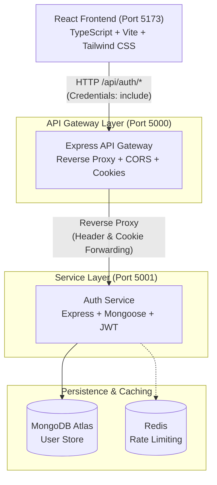
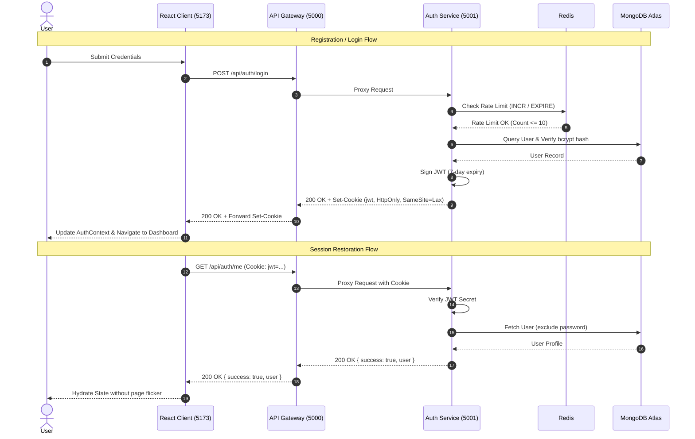
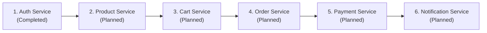

# MERN E-Commerce Platform

A modular, microservices-oriented e-commerce backend and frontend architecture featuring an API Gateway, an isolated Authentication Microservice with Redis rate limiting, MongoDB Atlas persistence, and a React TypeScript client with secure HTTP-only cookie session management.

## Overview

This project is an e-commerce platform designed from the ground up to follow an incremental microservices architecture. Rather than building a tightly coupled monolithic application, core domain responsibilities are decoupled into dedicated services communicating behind a single API Gateway.

The initial development stage establishes the platform foundation:
* An API Gateway providing unified routing, CORS configuration, security headers, and reverse proxying.
* A dedicated Authentication Service handling user identity, credential validation, Google OAuth, password hashing, JWT lifecycle, and Redis rate limiting.
* A single-page React frontend with client-side routing, responsive UI, session restoration, and route guards.

Future e-commerce domains (catalog, cart, orders, payments, notifications) are designed to integrate as independent microservices behind the Gateway without requiring architectural rewrites.

## Current Architecture

The platform uses a decoupled client-gateway-service pattern where the frontend only interfaces directly with the API Gateway.



## Technology Stack

### Frontend
* React (v19)
* TypeScript
* Vite
* Tailwind CSS (v4)
* Axios
* Lucide React
* @react-oauth/google

### Backend
* Node.js (ES Modules)
* Express
* http-proxy-middleware
* Helmet
* Morgan
* Cookie-Parser
* CORS
* Dotenv

### Data & Infrastructure
* MongoDB Atlas (Mongoose ODM)
* Redis (ioredis)

### Authentication & Security
* JSON Web Tokens (jsonwebtoken)
* Secure HTTP-only cookies
* bcryptjs (Password hashing)
* Google OAuth 2.0 (google-auth-library)
* Atomic Redis Rate Limiter

## Project Structure

```text
E-Commerce/
├── client/                               # Frontend Single Page Application
│   ├── src/
│   │   ├── components/                   # Reusable UI components & route guards
│   │   │   ├── GoogleAuthButton.tsx
│   │   │   ├── Input.tsx
│   │   │   ├── Navbar.tsx
│   │   │   ├── ProtectedRoute.tsx
│   │   │   └── PublicOnlyRoute.tsx
│   │   ├── context/
│   │   │   └── AuthContext.tsx           # Authentication state & session restore
│   │   ├── pages/
│   │   │   ├── HomePage.tsx              # Minimal home / profile overview
│   │   │   ├── LoginPage.tsx             # Email/password & Google sign-in
│   │   │   └── RegisterPage.tsx          # Account registration form
│   │   ├── services/
│   │   │   ├── api.ts                    # Axios instance pointing to Gateway
│   │   │   └── authService.ts            # Auth API client functions
│   │   ├── types/
│   │   │   └── auth.ts                   # TypeScript interfaces and types
│   │   ├── App.tsx                       # Router configuration & providers
│   │   ├── index.css                     # Tailwind CSS entry
│   │   └── main.tsx                      # Application bootstrap
│   ├── .env / .env.example
│   ├── index.html
│   ├── package.json
│   ├── tsconfig.json
│   ├── tsconfig.node.json
│   └── vite.config.ts
├── gateway/                              # API Gateway Microservice
│   ├── .env / .env.example
│   ├── package.json
│   └── server.js                         # Proxy routing, CORS, and health checks
├── services/                             # Shared Microservices Root
│   ├── auth-service/                     # Authentication Microservice
│   │   ├── config/
│   │   │   ├── db.js                     # MongoDB connection manager
│   │   │   └── redis.js                  # Redis client with fallback handling
│   │   ├── controllers/
│   │   │   └── authController.js         # Register, login, google, logout, /me
│   │   ├── middleware/
│   │   │   ├── authMiddleware.js         # JWT cookie validation middleware
│   │   │   ├── errorMiddleware.js        # Global error & 404 handlers
│   │   │   └── rateLimiter.js            # Redis atomic counter rate limiter
│   │   ├── models/
│   │   │   └── User.js                   # Mongoose User schema & password hooks
│   │   ├── routes/
│   │   │   └── authRoutes.js             # Route declarations with rate limiter
│   │   ├── utils/
│   │   │   └── jwt.js                    # JWT signing & cookie helpers
│   │   ├── .env / .env.example
│   │   ├── package.json
│   │   └── server.js                     # Auth Service entry point
│   └── package.json                      # Shared microservices dependencies
├── package.json                          # Root repository orchestration scripts
└── README.md
```

## Authentication

The authentication system is self-contained within the Auth Service and exposes endpoints through the Gateway:

* **User Registration**: Validates name, email format, password complexity (minimum 6 characters), and password confirmation matching. Hashes passwords using bcrypt with salt factor 10.
* **Email/Password Login**: Compares credentials against bcrypt hashes and issues a signed JWT stored inside a secure HTTP-only cookie.
* **Google OAuth 2.0**: Validates Google ID tokens on the backend using `google-auth-library`, finding existing accounts by verified email or provisioning new user profiles.
* **Session Restoration (`/api/auth/me`)**: Restores user identity on client load by extracting and verifying the JWT from incoming HTTP-only cookies.
* **Protected Routes**: Express middleware (`protect`) verifies token validity and attaches the sanitized user instance to request objects.
* **Logout**: Clears the authentication cookie with an immediate expiration header.
* **Rate Limiting**: Protects sensitive endpoints (`/register`, `/login`, `/google`) with Redis atomic counters (10 requests per 15-minute sliding window) and returns standard `429 Too Many Requests` responses with `Retry-After` headers.

### Authentication Flow



## Microservices Architecture

The architecture enforces strict decoupling between services:

* **API Gateway**: Acts as the single public entry point for all frontend traffic. Manages CORS, preflight negotiations, client IP forwarding, cookie domain rewriting, and reverse proxy delegation.
* **Auth Service**: Holds exclusive ownership of user accounts, credential storage, password hashing algorithms, and token generation. No other service interacts directly with authentication datastores.
* **Data Ownership**: MongoDB access for user profiles is strictly isolated within the Auth Service.
* **Incremental Evolution**: Future services (`product-service`, `cart-service`, `order-service`, `payment-service`, `notification-service`) will be provisioned as independent services and registered with the Gateway.

## Database Architecture

The platform uses MongoDB Atlas for document storage.

```text
MongoDB Atlas Cluster
└── ecommerce
    └── users
        ├── _id: ObjectId
        ├── name: String
        ├── email: String (unique, indexed)
        ├── password: String (bcrypt hash, optional if googleId present)
        ├── googleId: String (sparse, indexed)
        ├── avatar: String
        ├── role: String (enum: ['user', 'admin'], default: 'user')
        ├── createdAt: Date
        └── updatedAt: Date
```

In the current stage, all services connect to the same cluster using logical database and collection boundaries. Physical cluster segregation is not required at this stage of development.

## API Specification

All endpoints are accessed via the API Gateway base path: `http://localhost:5000/api`

| Method | Endpoint | Description | Auth Required | Rate Limited |
| ------ | -------- | ----------- | ------------- | ------------ |
| `GET` | `/health` | Gateway health check and service registry status | No | No |
| `GET` | `/auth/health` | Auth Service health and Redis connection status | No | No |
| `POST` | `/auth/register` | Register a new account with email and password | No | Yes (10/15m) |
| `POST` | `/auth/login` | Authenticate using email and password | No | Yes (10/15m) |
| `POST` | `/auth/google` | Authenticate or register using Google OAuth ID token | No | Yes (10/15m) |
| `POST` | `/auth/logout` | Invalidate session and clear HTTP-only cookie | No | No |
| `GET` | `/auth/me` | Retrieve authenticated user profile from JWT cookie | Yes | No |

## Environment Variables

Configuration files use `.env` files per application. Template files (`.env.example`) are provided in each component directory.

### API Gateway (`gateway/.env`)
```env
PORT=5000
NODE_ENV=development
CLIENT_URL=http://localhost:5173
AUTH_SERVICE_URL=http://localhost:5001
```

### Auth Service (`services/auth-service/.env`)
```env
PORT=5001
NODE_ENV=development
MONGO_URI=mongodb+srv://<username>:<password>@<cluster>.mongodb.net/ecommerce?retryWrites=true&w=majority
REDIS_URL=redis://localhost:6379
JWT_SECRET=ecommerce_super_secret_jwt_key_2026_change_in_production
GOOGLE_CLIENT_ID=your_google_client_id.apps.googleusercontent.com
GATEWAY_URL=http://localhost:5000
```

### Frontend Client (`client/.env`)
```env
VITE_API_URL=http://localhost:5000/api
VITE_GOOGLE_CLIENT_ID=your_google_client_id.apps.googleusercontent.com
```

## Local Development

### Prerequisites
* Node.js (v18.0.0 or higher)
* npm (v9.0.0 or higher)
* MongoDB Atlas connection string (or local MongoDB instance)
* Redis server (optional; in-memory fallback activates automatically if Redis is unavailable)

### 1. Installation

Install dependencies across all components:

```bash
# Install Gateway dependencies
cd gateway && npm install && cd ..

# Install shared Microservices dependencies (auth-service and future services)
cd services && npm install && cd ..

# Install Client dependencies
cd client && npm install && cd ..
```

### 2. Environment Configuration

Copy the example environment files and configure your credentials:

```bash
cp gateway/.env.example gateway/.env
cp services/auth-service/.env.example services/auth-service/.env
cp client/.env.example client/.env
```

Ensure `MONGO_URI` in `services/auth-service/.env` contains your valid MongoDB Atlas connection string.

### 3. Starting the Services

Start each service in separate terminal sessions, or run the following root scripts:

```bash
# Terminal 1: Start Auth Microservice (Port 5001)
npm run auth-service

# Terminal 2: Start API Gateway (Port 5000)
npm run gateway

# Terminal 3: Start React Client (Port 5173)
npm run client
```

Open `http://localhost:5173` in your browser to access the application.

## Security Practices

* **HTTP-Only Cookies**: JWT tokens are transmitted exclusively inside `HttpOnly`, `SameSite=Lax` cookies, preventing client-side JavaScript access and mitigating cross-site scripting (XSS) token theft.
* **Password Hashing**: Passwords are never stored in plaintext. They are salted and hashed using `bcryptjs` with 10 salt rounds before database writes.
* **Brute-Force Protection**: Sensitive authentication endpoints enforce rate limiting via Redis atomic counters with automatic `429 Too Many Requests` status codes.
* **Sanitized Responses**: Mongoose schema serialization hooks automatically delete the `password` hash and internal `__v` metadata before returning user JSON objects.
* **Strict CORS Policies**: The API Gateway allows credentialed requests strictly from the configured `CLIENT_URL`.
* **Security Headers**: The API Gateway incorporates Helmet middleware for header protection.
* **Decoupled Internal Network**: The Auth Service runs on an internal port and is designed not to be exposed directly to public client traffic.

## Development Roadmap



* **Phase 1 (Completed)**: API Gateway, Auth Service, MongoDB Atlas, Redis rate limiting, React client with full authentication lifecycle.
* **Phase 2 (Planned)**: Product Catalog Service with search, filtering, categories, and inventory tracking.
* **Phase 3 (Planned)**: Shopping Cart Service with session-persisted cart state.
* **Phase 4 (Planned)**: Order Management Service with order lifecycles and address management.
* **Phase 5 (Planned)**: Payment Gateway Service supporting Stripe/PayPal webhooks and transaction records.
* **Phase 6 (Planned)**: Asynchronous Notification Service for transactional emails and event-driven updates.

## Architecture Principles

* **Single Responsibility**: Each microservice encapsulates one bounded business context.
* **Private Datastores**: No service reads or writes directly to another service's database tables or collections.
* **Gateway Facade**: Clients communicate with one public gateway URL; downstream service topology is hidden from the client.
* **Stateless Application Tier**: Services do not hold state in local memory; sessions are verified via stateless JWTs.
* **Independent Scalability**: Services can be scaled or containerized independently based on traffic demands.
* **Graceful Degradation**: Infrastructure dependencies such as Redis include localized fallbacks for resilient development.

## Verification & Build Validation

To validate frontend TypeScript compilation and bundling:

```bash
# Run TypeScript compilation and build validation for frontend
npm run build:client
```

## Contributing

1. Create a feature branch (`git checkout -b feature/domain-name`).
2. Adhere to code conventions and verify client builds cleanly (`npm run build:client`).
3. Maintain TypeScript types and interface definitions.
4. Submit a Pull Request with technical rationale and verification details.

## License

This project currently has no specified open-source license. All rights are reserved.