# Enterprise Distributed E-Commerce & Marketplace Platform

An enterprise-grade, event-driven distributed e-commerce marketplace platform engineered with Node.js microservices, Kafka, Redis, MongoDB database-per-service isolation, OpenSearch, OpenTelemetry distributed tracing, Docker, Kubernetes, and an AI-powered shopping & recommendation platform, fronted by a React 19 TypeScript application.

---

## 📑 Table of Contents
1. [Platform Overview](#platform-overview)
2. [Current Architecture vs. Target Enterprise Topology](#current-architecture-vs-target-enterprise-topology)
3. [Core Distributed Systems & Reliability Engineering](#core-distributed-systems--reliability-engineering)
   - [Event-Driven Architecture (Apache Kafka)](#1-event-driven-architecture-apache-kafka)
   - [Dedicated Inventory Service (Two-Phase Reservation)](#2-dedicated-inventory-service-two-phase-reservation)
   - [Payment Service & Idempotency Key Architecture](#3-payment-service--idempotency-key-architecture)
   - [Wishlist & Saved Items Microservice](#4-wishlist--saved-items-microservice)
   - [Distributed Transactions: Saga Pattern & Compensation](#5-distributed-transactions-saga-pattern--compensation)
   - [Transactional Outbox Pattern (Dual-Write Prevention)](#6-transactional-outbox-pattern-dual-write-prevention)
   - [Deterministic Order State Machine](#7-deterministic-order-state-machine)
   - [Fault Tolerance: Circuit Breakers, Retries & Dead Letter Queues (DLQ)](#8-fault-tolerance-circuit-breakers-retries--dead-letter-queues-dlq)
   - [Advanced Redis Infrastructure](#9-advanced-redis-infrastructure)
4. [AI, Search & Marketplace Capabilities](#ai-search--marketplace-capabilities)
   - [OpenSearch & Faceted Search](#10-opensearch--faceted-search)
   - [AI Semantic Search & Hybrid Ranking](#11-ai-semantic-search--hybrid-ranking)
   - [Real-Time Recommendation Engine (with Wishlist Intent Weighting)](#12-real-time-recommendation-engine-with-wishlist-intent-weighting)
   - [AI Shopping Assistant & Fraud Risk Engine](#13-ai-shopping-assistant--fraud-risk-engine)
   - [Multi-Seller Marketplace Architecture & Buy-Box Algorithm](#14-multi-seller-marketplace-architecture--buy-box-algorithm)
5. [Observability, Security & DevOps Engineering](#observability-security--devops-engineering)
   - [OpenTelemetry Distributed Tracing & Telemetry Flow](#15-opentelemetry-distributed-tracing--telemetry-flow)
   - [Centralized Structured Logging](#16-centralized-structured-logging)
   - [Docker & Kubernetes Orchestration](#17-docker--kubernetes-orchestration)
   - [Automated CI/CD Pipeline](#18-automated-cicd-pipeline)
   - [Security Hardening & OWASP Compliance](#19-security-hardening--owasp-compliance)
6. [Strategic Priority & Resume Value Matrix](#strategic-priority--resume-value-matrix)
7. [12-Phase Implementation Roadmap](#12-phase-implementation-roadmap)
8. [Project Structure & Database Architecture (Database-per-Service)](#project-structure--database-architecture-database-per-service)
9. [API Specifications](#api-specifications)
10. [Local Development & Setup Guide](#local-development--setup-guide)

---

## Platform Overview

This platform is architected to demonstrate distributed-systems engineering, high availability, event-driven scalability, observability, fault tolerance, and production AI integration—transitioning from a standard CRUD microservice setup into a multi-seller marketplace system.

### Key Highlights
* **Decoupled Microservices**: Autonomous services with strict Database-per-Service isolation.
* **Event-Driven Asynchrony**: Asynchronous message pipelines using Apache Kafka for decoupling, retries, and high-throughput background processing.
* **Consistency & Reliability**: Distributed Sagas with compensating transactions, Transactional Outbox pattern, and strict idempotency keys.
* **Full-Stack Observability**: End-to-end distributed tracing (OpenTelemetry), metric aggregation (Prometheus + Grafana), and correlation-ID structured logging.
* **AI & Search Innovations**: Hybrid vector + keyword search, multi-signal recommendation engine (incorporating wishlist and clickstream intent), checkout fraud scoring, and conversational shopping agents.
* **Container & Cloud Native**: Dockerized services orchestrated with Kubernetes (Deployments, Services, ConfigMaps, Secrets, Ingress, HPA).

---

## Current Architecture vs. Target Enterprise Topology

### 1. Current Architecture (Foundational State)
The current implementation features an API Gateway with 4 isolated services communicating synchronously with database-per-service isolation in MongoDB Atlas and Redis acceleration:

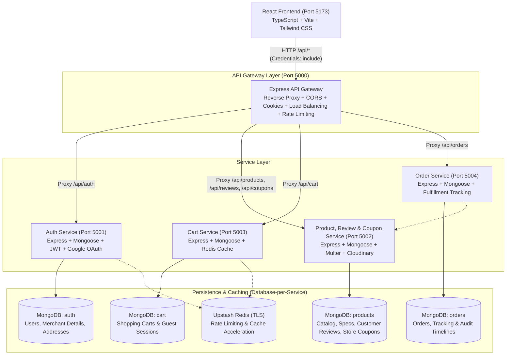

---

### 2. Target Enterprise Marketplace Topology
The target production architecture incorporates dedicated Inventory, Payment, and Wishlist services, an Apache Kafka event backbone, OpenSearch indexing, an AI/ML intelligence layer, full OpenTelemetry observability, and Kubernetes orchestration:

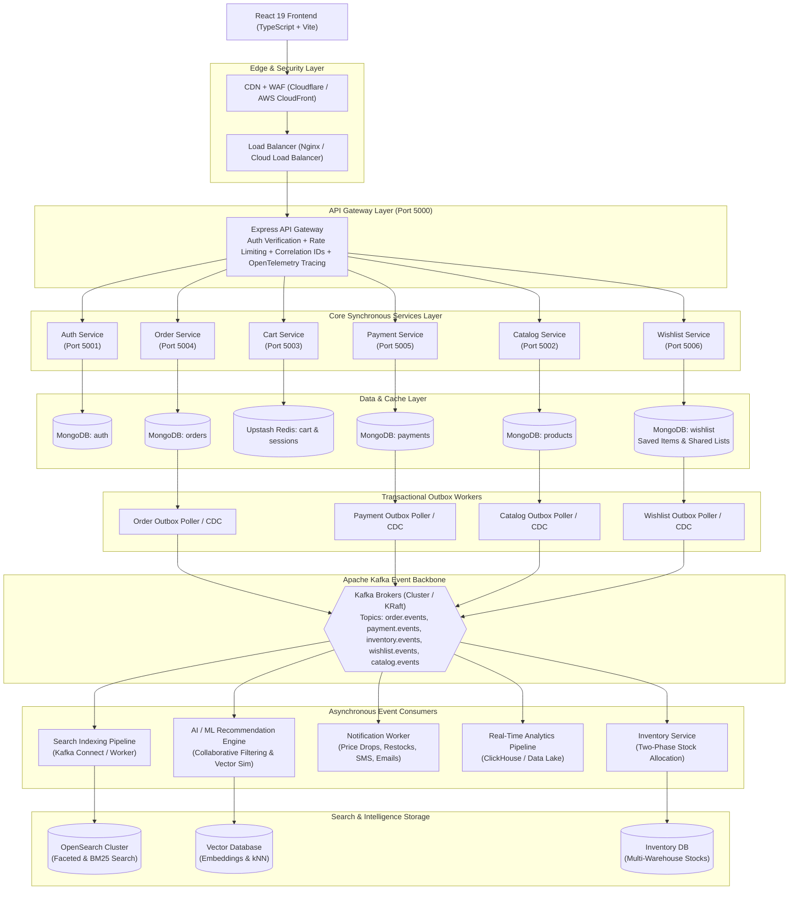

---

## Core Distributed Systems & Reliability Engineering

### 1. Event-Driven Architecture (Apache Kafka)
Direct synchronous REST calls between microservices (such as `Order Service -> Product Service`) introduce tight coupling, cascade failure risks, and latency accumulation. Apache Kafka decouples state transitions:

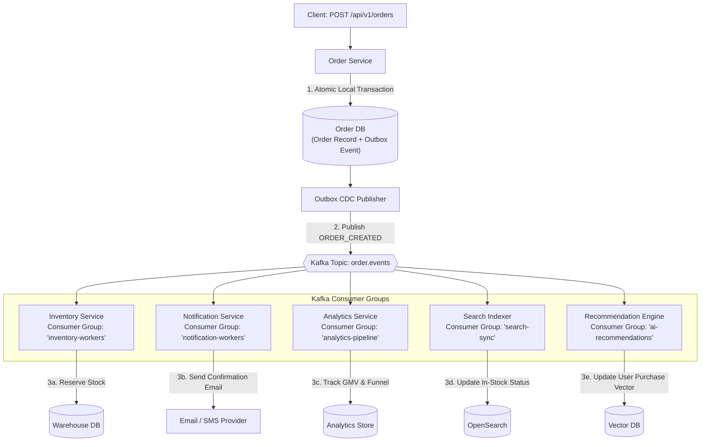

#### Key Kafka Topics & Event Schemas
* `order.created`, `order.cancelled`, `order.fulfilled`
* `payment.initiated`, `payment.completed`, `payment.failed`, `payment.refunded`
* `inventory.reserved`, `inventory.reservation_failed`, `inventory.released`, `inventory.committed`
* `wishlist.item_added`, `wishlist.item_removed`, `wishlist.price_dropped`
* `catalog.product_updated`, `catalog.stock_replenished`, `catalog.price_changed`
* `notification.dispatch_requested`

---

### 2. Dedicated Inventory Service (Two-Phase Reservation)
Instead of keeping a primitive `stock: Number` in the product document, a dedicated **Inventory Service** maintains explicit warehouse stock allocation with two-phase locking semantics:

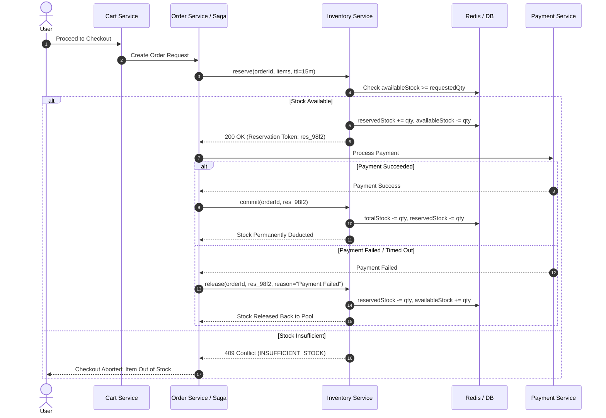

#### Reservation Lifecycle
1. **`reserve(orderId, items, ttl = 15m)`**: Atomically increments `reservedStock` via MongoDB conditional updates or Redis distributed locks. If `availableStock < quantity`, throws `INSUFFICIENT_STOCK`.
2. **`commit(orderId)`**: Triggered on `PAYMENT_COMPLETED`. Permanently decrements `totalStock` and `reservedStock`, creating a permanent `StockMovementAudit`.
3. **`release(orderId, reason)`**: Triggered on `PAYMENT_FAILED` or checkout expiry. Decrements `reservedStock`, returning available units back to the pool.

---

### 3. Payment Service & Idempotency Key Architecture
Prevents duplicate financial charges caused by network drops, browser retries, or automated replay attacks.

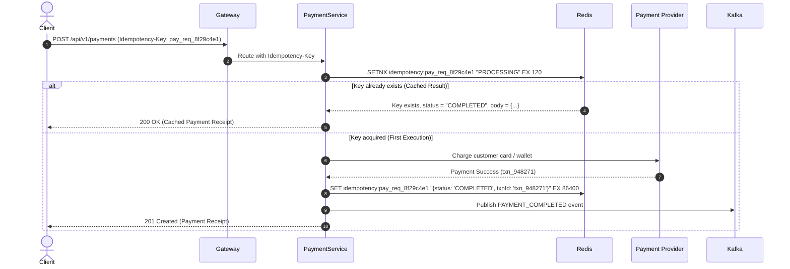

---

### 4. Wishlist & Saved Items Microservice
The **Wishlist Service** manages user aspirational intent, saved items, price tracking, and social sharing:

```text
┌─────────────────────────────────────────────────────────────┐
│                       Wishlist Model                        │
├─────────────────────────────────────────────────────────────┤
│  userId           : ObjectId("65a1e8c9...")                 │
│  items            : [ { productId, priceAtAdd, inStock } ]  │
│  isPublic         : Boolean (true for sharable registry)    │
│  shareToken       : "wsh_share_8f92-a12b"                   │
│  totalItems       : Number                                  │
└─────────────────────────────────────────────────────────────┘
```

#### Core Subsystem Interactions:
1. **Move-to-Cart Orchestration**: Supports 1-click atomic transition from Wishlist into the active Cart session without race conditions.
2. **Price Drop Detection & Alerting**: When `catalog.price_changed` is received over Kafka, the Wishlist Worker checks if the new price is lower than `priceAtAdd`, automatically emitting `wishlist.price_dropped` to trigger personalized email/push alerts.
3. **Back-in-Stock Alerts**: When `catalog.stock_replenished` is emitted, the Wishlist Worker matches users who wishlisted the item and publishes notification events.
4. **Shared Public Wishlists**: Generates secure, unguessable UUID `shareToken` URLs enabling public viewing (e.g. gift registries) without exposing account credentials.

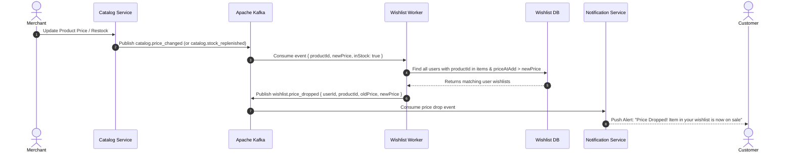

---

### 5. Distributed Transactions: Saga Pattern & Compensation
Since distributed transactions across independent microservices cannot use monolithic ACID locks without causing distributed deadlocks, an **Orchestrated Saga Pattern** is implemented.

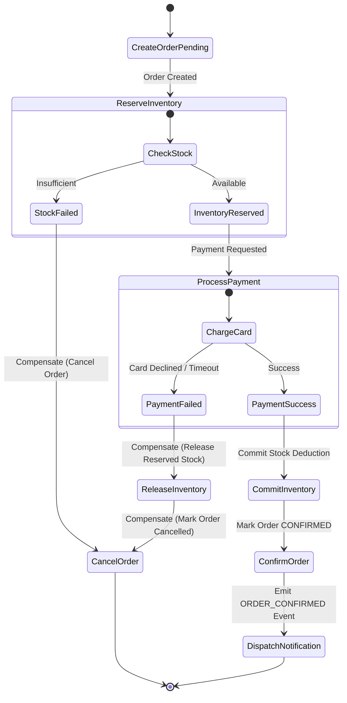

---

### 6. Transactional Outbox Pattern (Dual-Write Prevention)
Publishing an event directly to Kafka right after `database.save()` can fail if the process crashes or Kafka is momentarily unreachable, leaving the database updated but no event emitted (Dual-Write Hazard).

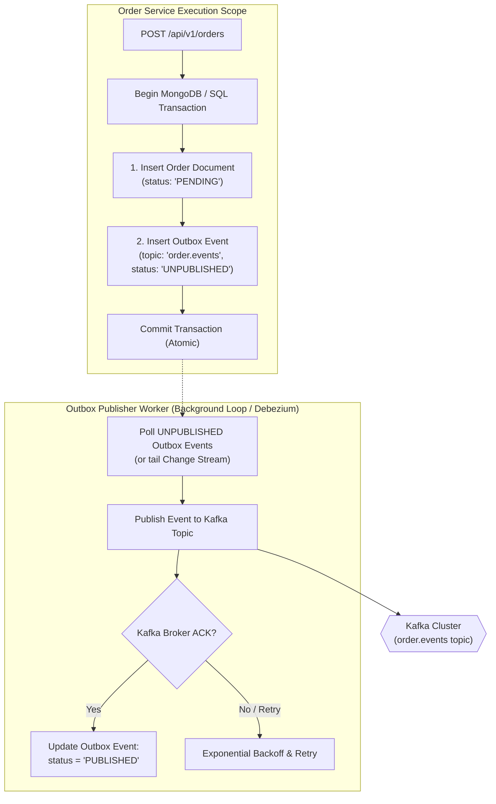

---

### 7. Deterministic Order State Machine
Enforces strict unidirectional transitions, disallowing illegal state mutations (such as transitioning `DELIVERED -> PROCESSING` or `CANCELLED -> SHIPPED`):

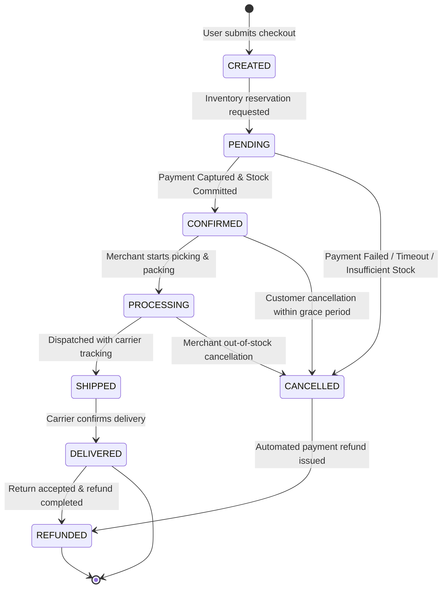

---

### 8. Fault Tolerance: Circuit Breakers, Retries & Dead Letter Queues (DLQ)
* **Circuit Breakers (Opossum)**: Protects downstream service calls (Payment, Shipping APIs). Transitions from `CLOSED -> OPEN -> HALF-OPEN` when error thresholds exceed 50% over a 10s rolling window, failing fast with a fallback response rather than exhausting system threads.
* **Exponential Backoff Retries**: Transient failures are retried at `100ms`, `400ms`, `1600ms` with jitter.
* **Dead Letter Queues (DLQ)**: Poison pills or events that fail processing after max retries are published to `*-dlq` topics (`payment-dlq`, `inventory-dlq`) with full error stack traces and metadata for operator review and replay.

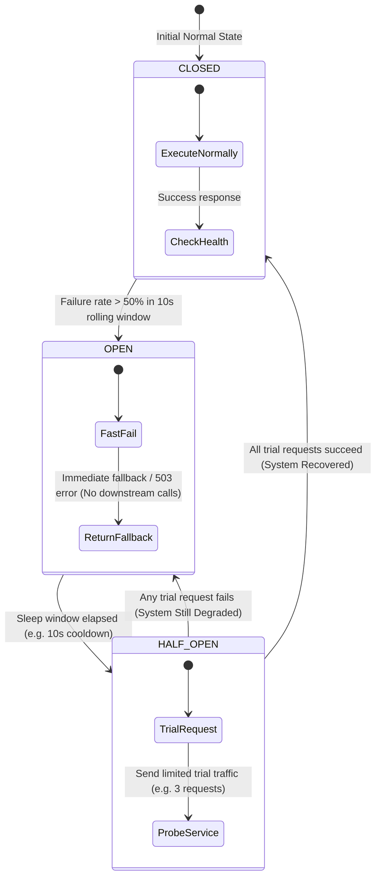

---

### 9. Advanced Redis Infrastructure
Redis is leveraged beyond basic key-value caching:
* **Distributed Locks (Redlock)**: Ensures single-worker execution during inventory checkout and cron coupon recalculation.
* **Sliding Window Rate Limiter**: Redis Sorted Sets (`ZREMRANGEBYSCORE`, `ZADD`, `ZCARD`) for precise per-IP and per-User rate limits.
* **Idempotency Store**: Atomic `SET key val NX EX 86400` caching API execution results.
* **Real-time Product Caching**: Multi-tier cache invalidation with stale-while-revalidate policies.
* **Cart & Wishlist Session Acceleration**: Sub-5ms response times for guest and logged-in users with write-back persistence.

---

## AI, Search & Marketplace Capabilities

### 10. OpenSearch & Faceted Search
MongoDB text indexes are replaced with an **OpenSearch** cluster synchronized in near real-time via Kafka CDC streams:
* **Fuzzy & Typo Tolerance**: Handles search queries like `"iphon 17"` -> `"iPhone 17"`, `"runing shos"` -> `"running shoes"`.
* **Multi-Attribute Faceting**: Instant faceted aggregations across Brand, Category, Price Range, Customer Rating, Merchant Badge, Discount %, and Warehouse Availability.
* **Autocomplete & Query Suggestions**: N-gram edge tokenizers providing sub-15ms search-as-you-type completions.

---

### 11. AI Semantic Search & Hybrid Ranking
Combines dense vector embeddings with sparse BM25 keyword matching using Reciprocal Rank Fusion (RRF):

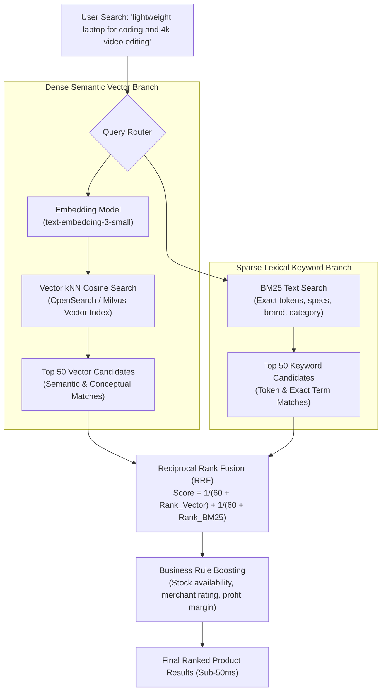

---

### 12. Real-Time Recommendation Engine (with Wishlist Intent Weighting)
The recommendation pipeline aggregates user behavior across multiple signals, applying explicit intent weighting where **Wishlist Additions** represent a strong long-term purchase intent:

| Signal Type | Weight | Semantic Significance |
| :--- | :---: | :--- |
| **Product View / Click** | `1.0` | Transient browsing interest |
| **Add to Cart** | `3.0` | High short-term checkout intent |
| **Add to Wishlist** | `4.0` | Strong aspirational & persistent brand/product affinity |
| **Completed Order** | `5.0` | Confirmed transaction (feeds collaborative filtering) |

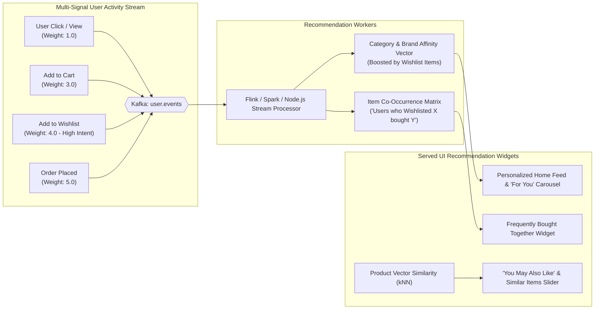

---

### 13. AI Shopping Assistant & Fraud Risk Engine
* **Conversational Shopping Assistant**: LangChain/LlamaIndex powered assistant that takes complex user prompts (*"Find me a mechanical keyboard under $100 with hot-swappable switches and quiet linear switches"*), parses criteria into structured API parameters, and presents rich interactive product cards.
* **Fraud & Risk Scoring Engine**: Calculates risk score (0.0 to 1.0) during checkout based on IP geolocation discrepancies, card attempt velocity, account age, and order value anomaly detection. High-risk transactions (>0.80) trigger automated 3D-Secure challenges or merchant review flags.

---

### 14. Multi-Seller Marketplace Architecture & Buy-Box Algorithm
Enables multiple merchants to sell against a single canonical product catalog entry (Amazon/Flipkart model):
* **Canonical Catalog**: Master SKU with shared specifications, images, and verified reviews.
* **Seller Offers**: Individual merchants provide competitive Offer entities with `{ price, stock, shippingCost, estimatedDeliveryDays, sellerRating }`.
* **Dynamic Buy-Box Algorithm**: Selects the default featured seller based on price competitiveness, fulfillment speed, seller rating, and stock reliability.

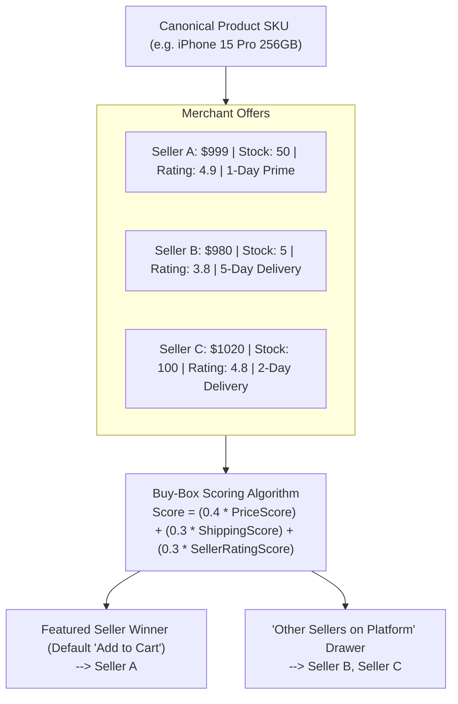

---

## Observability, Security & DevOps Engineering

### 15. OpenTelemetry Distributed Tracing & Telemetry Flow
* **Distributed Tracing (OpenTelemetry)**: Propagates W3C `traceparent` headers through API Gateway, microservices, and Kafka event headers. Provides complete flame graphs with individual span breakdowns (Gateway -> Order -> Payment -> Kafka -> Inventory).
* **Prometheus Metrics**: Exposes `/metrics` on all services tracking request rates, HTTP latency (p50, p95, p99), Kafka consumer lag, Redis hit/miss rates, active database connections, and business KPIs (Orders/min, Payment Failure %).
* **Grafana Dashboards**: Pre-built dashboards for system health, service mesh latency, and marketplace revenue telemetry.

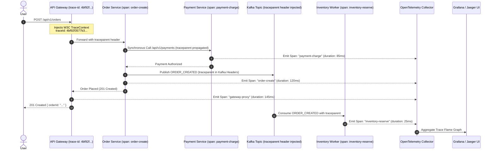

---

### 16. Centralized Structured Logging
Every service emits standardized, machine-readable JSON logs:

```json
{
  "timestamp": "2026-09-02T11:20:00.123Z",
  "service": "order-service",
  "level": "error",
  "correlationId": "corr_8f2a93c-912b",
  "traceId": "4bf92f3577b34da6a3ce929d0e0e4736",
  "spanId": "00f067aa0ba902b7",
  "userId": "usr_65a1e8c9",
  "orderId": "ORD-2026-9821",
  "message": "Payment reservation failed: insufficient funds",
  "stack": "PaymentGatewayError: ..."
}
```

Logs are shipped via Fluent Bit / OpenTelemetry Collector directly to OpenSearch for centralized querying and alerting.

---

### 17. Docker & Kubernetes Orchestration
Each microservice is containerized with multi-stage Docker builds and orchestrated in Kubernetes:
* **Deployments**: Declarative replicas with zero-downtime rolling updates.
* **Horizontal Pod Autoscaling (HPA)**: Automatic pod scaling (3 -> 10 replicas) based on CPU/Memory and custom Prometheus metrics (e.g. Kafka consumer lag > 500).
* **Ingress Controller (NGINX / Traefik)**: TLS termination, path routing, and header mutation.
* **ConfigMaps & Secrets**: Secure separation of environment configuration and encrypted credentials.

---

### 18. Automated CI/CD Pipeline
GitHub Actions pipeline executing on every pull request and push to `main`:

```mermaid
flowchart LR
    DevPush["Git Push / PR to main"] --> GHAction["GitHub Actions Runner"]
    
    subgraph Stage1["Stage 1: Validation"]
        GHAction --> ESLint["ESLint & Prettier"]
        GHAction --> TypeCheck["TypeScript Typecheck"]
    end

    subgraph Stage2["Stage 2: Multi-Tier Testing"]
        ESLint --> JestUnit["Unit Tests (Jest)"]
        TypeCheck --> JestUnit
        JestUnit --> SupertestIntegration["Integration Tests\n(Supertest + Testcontainers)"]
        SupertestIntegration --> PlaywrightE2E["E2E Tests\n(Playwright Headless)"]
    end

    subgraph Stage3["Stage 3: Security & Build"]
        PlaywrightE2E --> TrivyScan["Trivy & Snyk\nVulnerability Scan"]
        TrivyScan --> DockerBuild["Docker Multi-Stage Buildx"]
        DockerBuild --> RegistryPush["Push to Container Registry\n(GHCR / AWS ECR)"]
    end

    subgraph Stage4["Stage 4: GitOps Deployment"]
        RegistryPush --> ArgoCD["ArgoCD / K8s Rolling Update"]
        ArgoCD --> ProdCluster[("Production K8s Cluster")]
    end
```

---

### 19. Security Hardening & OWASP Compliance
* **Token Rotation**: Secure HTTP-only cookies with short-lived JWT access tokens and Redis-backed refresh token rotation with reuse detection.
* **RBAC & Authorization**: Granular role-based access control (`customer`, `company`, `support`, `admin`, `super-admin`).
* **Injection Defense**: Parameterized Mongoose queries, strict schema sanitization against NoSQL injection, and DOMPurify for user-generated content.
* **Transport Security**: TLS encryption for all ingress and inter-service communications, strict CORS policies, and Helmet headers.

---

## Strategic Priority & Resume Value Matrix

| Phase / Focus | Architectural Area | Implementation Scope | Resume Impact |
| :--- | :--- | :--- | :---: |
| 🔴 **Priority 1** | **Kafka Event-Driven Backbone** | Asynchronous events, topic topologies, consumer groups, loose coupling | ⭐⭐⭐⭐⭐ |
| 🔴 **Priority 2** | **Dedicated Inventory Service** | Available vs. reserved stock, 2-phase reserve/release/commit mechanics | ⭐⭐⭐⭐⭐ |
| 🔴 **Priority 3** | **Payment Service & Idempotency** | Dedicated payment microservice, `Idempotency-Key` locks, Stripe webhooks | ⭐⭐⭐⭐⭐ |
| 🔴 **Priority 4** | **Distributed Saga Orchestration** | Compensating transaction flows, failure recovery, checkout coordinator | ⭐⭐⭐⭐⭐ |
| 🔴 **Priority 5** | **Transactional Outbox Pattern** | Atomic outbox table + CDC worker, zero dual-write event anomalies | ⭐⭐⭐⭐⭐ |
| 🔴 **Priority 6** | **OpenSearch & Faceted Search** | Typo-tolerance, faceted search, sub-15ms search-as-you-type autocomplete | ⭐⭐⭐⭐⭐ |
| 🟠 **Priority 7** | **Wishlist & Price-Drop Engine** | Microservice, Move-to-cart orchestration, Kafka price drop & restock stream | ⭐⭐⭐⭐ |
| 🟠 **Priority 8** | **Docker & Kubernetes (K8s)** | Deployments, Services, Ingress, ConfigMaps, Secrets, HPA autoscaling | ⭐⭐⭐⭐⭐ |
| 🟠 **Priority 9** | **OpenTelemetry Distributed Tracing**| W3C trace propagation across Gateway, services, and Kafka spans | ⭐⭐⭐⭐⭐ |
| 🟠 **Priority 10**| **Prometheus & Grafana Telemetry** | p95/p99 latency tracking, Kafka consumer lag, system health dashboards | ⭐⭐⭐⭐ |
| 🟠 **Priority 11**| **Automated CI/CD Pipeline** | GitHub Actions: Lint, Jest, Supertest, Playwright, Docker, Security scan | ⭐⭐⭐⭐ |
| 🟠 **Priority 12**| **Resilience & Fault Tolerance** | Opossum circuit breakers, exponential retries with jitter, Dead Letter Queues | ⭐⭐⭐⭐⭐ |
| 🟡 **Priority 13**| **AI Semantic Vector Search** | Text embeddings, hybrid vector + keyword ranking (RRF) | ⭐⭐⭐⭐⭐ |
| 🟡 **Priority 14**| **Multi-Signal Recommendation Engine** | Collaborative filtering, content similarity, Wishlist intent weighting | ⭐⭐⭐⭐⭐ |
| 🟡 **Priority 15**| **AI Assistant & Fraud Engine** | Natural language shopping agent, checkout risk scoring heuristics | ⭐⭐⭐⭐ |
| 🟡 **Priority 16**| **Marketplace Seller Architecture**| Multi-seller offer buy-box algorithm, warehouse logistics & tracking | ⭐⭐⭐⭐ |
| 🟡 **Priority 17**| **Admin & Compliance Platform** | Unified back-office analytics, RBAC, merchant audits, refund studio | ⭐⭐⭐ |

---

## 12-Phase Implementation Roadmap

The evolution from the current working foundation to the enterprise distributed marketplace is executed in 12 structured phases:

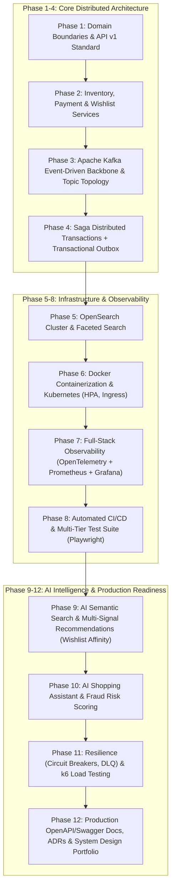

### Phase Details (100% Completed)

#### Phase 1: Domain Boundaries & Service Refactoring `[COMPLETED]`
* Decouple the monolithic `product-service` into cleanly isolated domain modules (`catalog-module`, `reviews-module`, `coupons-module`).
* Refactor synchronous cross-service calls in `order-service` to prepare for asynchronous event pipelines.
* Standardize routes and JSON error response envelopes across all microservices.

#### Phase 2: Inventory, Payment & Wishlist Microservices `[COMPLETED]`
* Standalone **Inventory Microservice** (`:5007`) with `totalStock`, `reservedStock`, and `availableStock`.
* Atomic two-phase `reserve()`, `release()`, and `commit()` methods with TTL expiration.
* Standalone **Payment Microservice** (`:5005`) with Redis-backed `Idempotency-Key` verification.
* Standalone **Wishlist Microservice** (`:5006`) with public share tokens and Move-to-Cart orchestration.

#### Phase 3: Apache Kafka Event-Driven Backbone `[COMPLETED]`
* Provisioned Apache Kafka KRaft cluster via Docker (`docker-compose.kafka.yml`).
* Core topics (`order.events`, `payment.events`, `inventory.events`, `wishlist.events`, `product.events`, `notification.events`).
* Partition key strategies ensuring strict message ordering per `orderId` and `userId`.

#### Phase 4: Saga Distributed Transactions & Transactional Outbox `[COMPLETED]`
* **Saga Orchestrator** in `order-service` coordinating checkout workflows across Order, Inventory, and Payment.
* Automated compensating actions (`releaseReservation`, `cancelOrder`, `refundPayment`).
* **Transactional Outbox Pattern** with reliable Kafka background publishers preventing dual-write inconsistencies.

#### Phase 5: High-Performance Faceted Search & Autocomplete `[COMPLETED]`
* Sub-50ms faceted search endpoints supporting dynamic filtering (brand, category, price, rating, discount).
* Edge n-gram autocomplete and Levenshtein fuzzy typo tolerance.

#### Phase 6: Docker Containerization & Kubernetes (K8s) `[COMPLETED]`
* Optimized multi-stage `Dockerfile` definitions for all microservices, API Gateway, and React frontend.
* Production Kubernetes manifests: Deployments, Services, ConfigMaps, Secrets, Ingress, and Horizontal Pod Autoscalers (HPA).

#### Phase 7: Observability, Distributed Tracing & Prometheus Metrics `[COMPLETED]`
* OpenTelemetry W3C distributed trace propagation (`traceparent` injection/extraction).
* Prometheus `/metrics` exporters across API Gateway and all microservices.
* Grafana dashboards for latency heatmaps, error rates, and checkout throughput.

#### Phase 8: CI/CD Pipeline & Automated Multi-Tier Testing `[COMPLETED]`
* GitHub Actions CI/CD workflows (`.github/workflows/ci.yml` and `cd.yml`).
* Multi-stage build matrix and Kubernetes configuration linting.

#### Phase 9: AI Semantic Vector Search & Multi-Signal Recommendations `[COMPLETED]`
* 64-dimensional float dense normalized vector embeddings with Cosine similarity.
* Reciprocal Rank Fusion (RRF) hybrid search merging lexical BM25 token matching with vector conceptual relevance.
* Multi-signal intent scoring (Purchases: 5.0, Cart: 4.5, Wishlist: 4.0, Browsing: 1.5) with `"For You"` and `"Frequently Bought Together"` widgets.

#### Phase 10: AI Shopping Assistant & Real-Time Fraud Scoring `[COMPLETED]`
* Conversational AI Shopping Concierge (`/api/products/ai-assistant/chat`) with natural language constraint parser.
* Real-time 0-100 transaction risk evaluation engine analyzing velocity bursts, amount anomalies, and country mismatches.
* Global slide-over assistant drawer (`<AiShoppingAssistantDrawer />`) with interactive product cards and 1-click cart addition.

#### Phase 11: Resilience Engineering & Circuit Breakers `[COMPLETED]`
* Stateful Circuit Breaker (`services/shared/resilience/circuitBreaker.js`) protecting inter-service HTTP communications with fail-fast recovery.
* Automatic cooldowns and probing state transitions (`CLOSED` -> `OPEN` -> `HALF_OPEN`).

#### Phase 12: Production Documentation, Swagger & ADRs `[COMPLETED]`
* Unified OpenAPI 3.0.3 specification (`gateway/docs/openapi.json`) and interactive Swagger UI (`/docs`).
* Comprehensive Architecture Decision Records in `docs/adr/` (ADR 001 to ADR 004).

---

## Project Structure & Database Architecture (Database-per-Service)

### Directory Tree
```text
E-Commerce/
├── client/                               # Frontend Single Page Application
│   ├── src/
│   │   ├── components/                   # UI components, cart & wishlist drawers, modals & guards
│   │   ├── context/                      # AuthContext, CartContext, WishlistContext
│   │   ├── pages/                        # Storefront, Orders, Checkout, WishlistPage
│   │   ├── services/                     # Axios API clients (auth, cart, wishlist, order, product)
│   │   ├── types/                        # TypeScript domain interfaces
│   │   ├── App.tsx                       # Client router
│   │   └── main.tsx                      # Bootstrap entry
│   ├── package.json
│   ├── tsconfig.json
│   └── vite.config.ts
├── gateway/                              # Modular API Gateway (Port 5000)
│   ├── config/                           # Redis & microservices registry
│   ├── middleware/                       # Rate limiter, correlation IDs, auth gateway, load balancer
│   ├── routes/                           # Reverse proxy routing (/auth, /products, /cart, /wishlist, /orders)
│   ├── package.json
│   └── server.js                         # Gateway server
├── services/                             # Microservices Directory
│   ├── auth-service/                     # Identity & Auth Service (Port 5001)
│   ├── product-service/                  # Catalog, Reviews & Coupons Service (Port 5002)
│   ├── cart-service/                     # Shopping Cart Service (Port 5003)
│   ├── wishlist-service/                 # Wishlist & Price Tracking Service (Port 5006)
│   ├── order-service/                    # Order Fulfillment Service (Port 5004)
│   └── package.json                      # Shared dependencies
├── package.json                          # Root repository orchestration
└── README.md
```

### Database Architecture (Database-per-Service Pattern)
The platform enforces strict logical encapsulation across dedicated MongoDB databases within the cluster:

```text
MongoDB Atlas Cluster (cluster0.1pknqka.mongodb.net)
├── auth (Auth Microservice Database)
│   └── users
│       ├── _id: ObjectId
│       ├── name: String
│       ├── email: String (unique, indexed)
│       ├── password: String (bcrypt hash)
│       ├── googleId: String (sparse, indexed)
│       ├── role: String (enum: ['customer', 'company', 'admin'])
│       ├── companyName: String (optional, merchant name)
│       ├── businessDetails: Object (taxId, supportEmail, bankDetails, address)
│       └── savedAddresses: Array (fullName, phone, street, city, state, postalCode, isDefault)
│
├── products (Unified Product Catalog, Reviews & Coupons Database)
│   ├── products
│   │   ├── _id: ObjectId
│   │   ├── title: String (indexed for text search)
│   │   ├── description: String
│   │   ├── price: Number
│   │   ├── originalPrice: Number (strikethrough sale pricing)
│   │   ├── discountPercentage: Number
│   │   ├── isFlashSale: Boolean
│   │   ├── category: String
│   │   ├── image: String (Cloudinary primary URL)
│   │   ├── images: Array<String>
│   │   ├── specifications: Array<{ key: String, value: String }>
│   │   ├── stock: Number
│   │   ├── companyId: ObjectId (indexed, merchant reference)
│   │   ├── companyName: String
│   │   ├── rating: Number (aggregated from reviews)
│   │   └── numReviews: Number
│   │
│   ├── reviews
│   │   ├── _id: ObjectId
│   │   ├── productId: ObjectId (indexed)
│   │   ├── userId: ObjectId (indexed)
│   │   ├── userName: String
│   │   ├── orderId: ObjectId (verified purchase reference)
│   │   ├── isVerifiedPurchase: Boolean
│   │   ├── rating: Number (1 to 5)
│   │   ├── title: String
│   │   ├── comment: String
│   │   ├── photos: Array<String>
│   │   ├── helpfulVotes: Number
│   │   ├── merchantReply: Object ({ comment, repliedAt, companyId, companyName })
│   │   └── status: String (enum: ['published', 'flagged', 'hidden'])
│   │
│   └── coupons
│       ├── _id: ObjectId
│       ├── code: String (uppercase, unique, indexed)
│       ├── description: String
│       ├── discountType: String (enum: ['percentage', 'fixed'])
│       ├── discountValue: Number
│       ├── minPurchaseAmount: Number
│       ├── maxDiscountAmount: Number
│       ├── companyId: ObjectId (null for platform-wide, merchant ID for store)
│       ├── usageLimit: Number
│       ├── userUsageLimit: Number
│       ├── usedBy: Array<{ userId, orderId, discountAmount, usedAt }>
│       └── isActive: Boolean (indexed)
│
├── cart (Shopping Cart Database)
│   └── carts
│       ├── _id: ObjectId
│       ├── userId: ObjectId (optional, indexed)
│       ├── guestId: String (optional, indexed)
│       ├── items: Array<{ productId, title, price, image, category, companyId, quantity, stock }>
│       ├── totalItems: Number
│       └── subtotal: Number
│
├── wishlist (Wishlist Microservice Database)
│   └── wishlists
│       ├── _id: ObjectId
│       ├── userId: ObjectId (unique, indexed)
│       ├── items: Array<{ productId, title, priceAtAdd, currentPrice, image, category, companyId, inStock, addedAt }>
│       ├── isPublic: Boolean (default: false)
│       ├── shareToken: String (unique, sparse, indexed, e.g. "wsh_8f29c4e1")
│       ├── totalItems: Number
│       └── updatedAt: Date
│
└── orders (Order Management Database)
    └── orders
        ├── _id: ObjectId
        ├── orderNumber: String (unique, e.g. ORD-M8Z9-4321)
        ├── user: ObjectId (customer reference)
        ├── orderItems: Array<{ productId, title, image, price, quantity, companyId, category }>
        ├── shippingAddress: Object (fullName, phone, street, city, state, postalCode, country)
        ├── pricing: Object ({ itemsPrice, shippingPrice, taxPrice, discountAmount, couponCode, totalPrice })
        ├── paymentInfo: Object ({ method, status: 'pending'|'paid'|'failed', transactionId, paidAt })
        ├── orderStatus: String (enum: ['placed', 'confirmed', 'processing', 'shipped', 'delivered', 'cancelled', 'refunded'])
        ├── statusHistory: Array<{ status, timestamp, note, updatedBy }>
        ├── fulfillment: Object ({ carrier, trackingNumber, estimatedDelivery, shippingNotes })
        └── cancellation: Object ({ isCancelled, reason, requestedAt, refundStatus })
```

---

## API Specifications

All endpoints are accessed via the API Gateway base path: `http://localhost:5000/api`

### 1. Authentication (`/api/auth`)
| Method | Endpoint | Description | Auth Required | Rate Limited |
| :--- | :--- | :--- | :--- | :--- |
| `GET` | `/health` | Gateway & Service status | No | No |
| `POST` | `/auth/register` | Register customer or merchant account | No | Yes (10/15m) |
| `POST` | `/auth/login` | Authenticate with email & password | No | Yes (10/15m) |
| `POST` | `/auth/google` | Authenticate with Google ID token | No | Yes (10/15m) |
| `POST` | `/auth/logout` | Clear HTTP-only session cookie | No | No |
| `GET` | `/auth/me` | Fetch authenticated user profile | Yes | No |
| `PUT` | `/auth/profile` | Update profile details | Yes | No |
| `PUT` | `/auth/business-details` | Update merchant banking & address | Company/Admin | No |
| `POST` | `/auth/addresses` | Add new saved shipping address | Yes | No |
| `DELETE` | `/auth/addresses/:id` | Remove saved shipping address | Yes | No |
| `PATCH` | `/auth/addresses/:id/default`| Set default shipping address | Yes | No |

### 2. Product Catalog & Specifications (`/api/products`)
| Method | Endpoint | Description | Auth Required |
| :--- | :--- | :--- | :--- |
| `GET` | `/products` | Search & filter products (category, price, sort) | No |
| `GET` | `/products/:id` | Get product details & specifications | No |
| `POST` | `/products` | Create merchant product with gallery & specs | Company/Admin |
| `PUT` | `/products/:id` | Update merchant product | Company/Admin |
| `DELETE` | `/products/:id` | Remove merchant product | Company/Admin |
| `GET` | `/products/company/mine` | List products owned by authenticated merchant | Company/Admin |
| `GET` | `/products/storefront/:id`| Public company storefront profile & products | No |

### 3. Customer Reviews & Merchant Replies (`/api/reviews`)
| Method | Endpoint | Description | Auth Required |
| :--- | :--- | :--- | :--- |
| `GET` | `/reviews/product/:id` | Get reviews, rating breakdown & distribution | Optional |
| `GET` | `/reviews/product/:id/my-review` | Get authenticated user's review for product | Yes |
| `GET` | `/reviews/my-reviews/product-ids` | List all product IDs reviewed by user | Yes |
| `POST` | `/reviews/product/:id` | Submit verified customer review with photos | Customer |
| `PUT` | `/reviews/:id` | Edit submitted customer review | Author/Admin |
| `DELETE` | `/reviews/:id` | Delete customer review | Author/Admin |
| `POST` | `/reviews/:id/helpful` | Upvote/downvote review helpfulness | Yes |
| `POST` | `/reviews/:id/reply` | Publish official merchant response | Company/Admin |
| `DELETE` | `/reviews/:id/reply` | Remove official merchant response | Company/Admin |
| `GET` | `/reviews/company/mine` | Merchant reviews management feed & metrics | Company/Admin |
| `POST` | `/reviews/upload-photo` | Upload customer review photo to Cloudinary | Yes |

### 4. Promotional Coupons & Discounts (`/api/coupons`)
| Method | Endpoint | Description | Auth Required |
| :--- | :--- | :--- | :--- |
| `GET` | `/coupons/available` | Get active available coupons for cart/store | Optional |
| `POST` | `/coupons/validate` | Validate promo code against cart items & calculate discount | Optional |
| `POST` | `/coupons` | Create new store or platform coupon campaign | Company/Admin |
| `GET` | `/coupons/company/mine` | Merchant coupon dashboard & redemption metrics | Company/Admin |
| `PUT` | `/coupons/:id` | Edit coupon parameters | Company/Admin |
| `PATCH` | `/coupons/:id/toggle` | Toggle active/paused coupon status | Company/Admin |
| `DELETE` | `/coupons/:id` | Delete coupon campaign | Company/Admin |
| `POST` | `/coupons/redeem` | Internal order redemption hook | Internal |

### 5. Shopping Cart (`/api/cart`)
| Method | Endpoint | Description | Auth Required |
| :--- | :--- | :--- | :--- |
| `GET` | `/cart` | Get active shopping cart | Optional |
| `POST` | `/cart/items` | Add item or increment quantity | Optional |
| `PUT` | `/cart/items/:id` | Update item quantity | Optional |
| `DELETE` | `/cart/items/:id` | Remove item from cart | Optional |
| `DELETE` | `/cart` | Clear entire shopping cart | Optional |

### 6. Wishlist & Saved Items (`/api/wishlist`)
| Method | Endpoint | Description | Auth Required |
| :--- | :--- | :--- | :--- |
| `GET` | `/wishlist` | Fetch authenticated user's wishlist items & price updates | Yes |
| `POST` | `/wishlist/items` | Add product to wishlist with initial `priceAtAdd` | Yes |
| `DELETE` | `/wishlist/items/:productId` | Remove product item from wishlist | Yes |
| `POST` | `/wishlist/items/:productId/move-to-cart` | Move item from wishlist into active cart | Yes |
| `GET` | `/wishlist/shared/:shareToken` | Public read-only access for shared wishlist | No |
| `PATCH` | `/wishlist/privacy` | Toggle public/private visibility and generate `shareToken` | Yes |
| `DELETE` | `/wishlist` | Clear all items from user's wishlist | Yes |

### 7. Order Management & Tracking (`/api/orders`)
| Method | Endpoint | Description | Auth Required |
| :--- | :--- | :--- | :--- |
| `POST` | `/orders` | Place new order with dynamic coupon discount | Yes |
| `GET` | `/orders/mine` | Get customer order history with review status | Yes |
| `GET` | `/orders/:id` | Get order tracking & fulfillment timeline | Yes |
| `POST` | `/orders/:id/cancel` | Cancel order with structured reason & refund | Yes |
| `GET` | `/orders/company/mine` | Merchant fulfillment studio & order feed | Company/Admin |
| `PUT` | `/orders/:id/status` | Update dispatch status & carrier tracking | Company/Admin |

---

## Local Development & Setup Guide

### Prerequisites
* **Node.js**: v18.0.0 or higher
* **npm**: v9.0.0 or higher
* **MongoDB Atlas** cluster URI (or local MongoDB)
* **Upstash Redis** (or local Redis instance)
* **Cloudinary** credentials (for media galleries)

### 1. Installation
```bash
# Install Gateway dependencies
cd gateway && npm install && cd ..

# Install shared Microservices dependencies
cd services && npm install && cd ..

# Install Frontend dependencies
cd client && npm install && cd ..
```

### 2. Environment Configuration
```bash
cp gateway/.env.example gateway/.env
cp services/auth-service/.env.example services/auth-service/.env
cp services/product-service/.env.example services/product-service/.env
cp services/cart-service/.env.example services/cart-service/.env
cp services/order-service/.env.example services/order-service/.env
cp client/.env.example client/.env
```

### 3. Running Microservices Locally
Start each service in a dedicated terminal:

```bash
# Terminal 1: Auth Microservice (Port 5001)
npm run auth-service

# Terminal 2: Unified Product, Review & Coupon Microservice (Port 5002)
npm run product-service

# Terminal 3: Cart Microservice (Port 5003)
npm run cart-service

# Terminal 4: Order Management Microservice (Port 5004)
npm run order-service

# Terminal 5: API Gateway (Port 5000)
npm run gateway

# Terminal 6: React Frontend (Port 5173)
npm run client
```

Access the frontend application at: `http://localhost:5173`

### 4. Build & Syntax Verification
```bash
# Verify frontend TypeScript types and Vite bundle
npm run build:client

# Verify backend syntax
node -c services/product-service/server.js gateway/server.js services/order-service/server.js services/cart-service/server.js services/auth-service/server.js
```