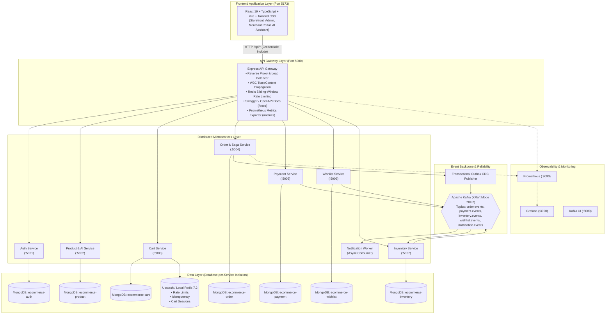
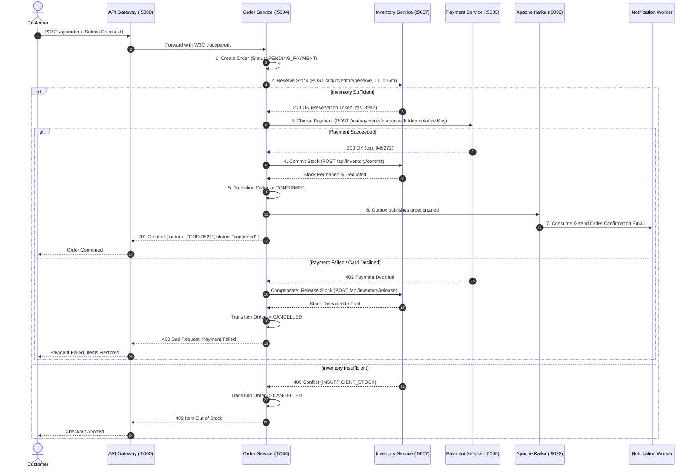
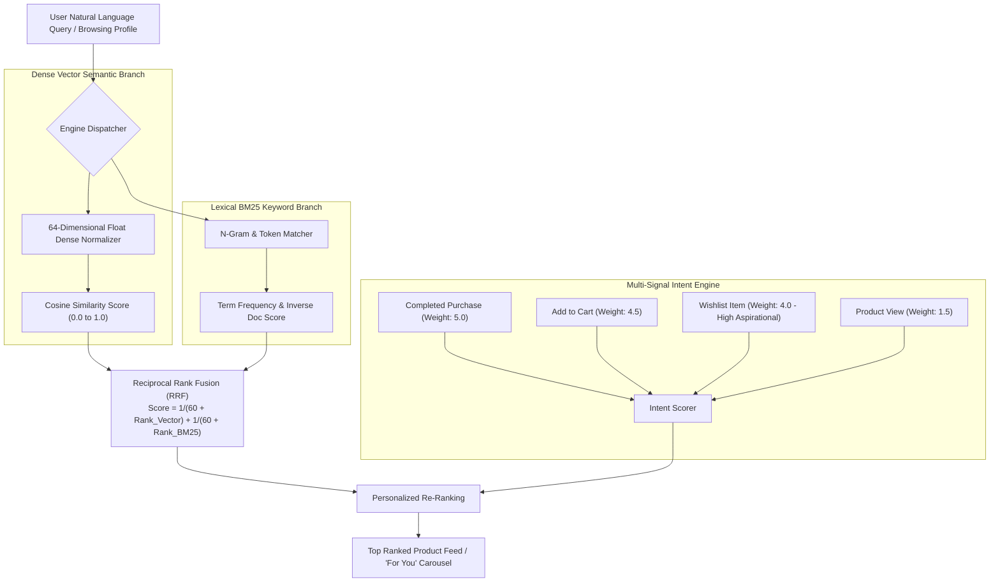

# NovaCommerce Enterprise Distributed Marketplace: System Architecture & Technical Specifications

> **System Status**: Production-Ready / Enterprise Distributed Topology  
> **All 12 Phases**: 100% Completed  
> **Repository**: [Next-Gen-Coder-2007/E-Commerce](https://github.com/Next-Gen-Coder-2007/E-Commerce)

---

## 1. Executive System Overview

NovaCommerce is an enterprise distributed multi-vendor e-commerce platform engineered with Node.js microservices, Apache Kafka (KRaft mode) event streaming, Redis distributed caching, MongoDB Database-per-Service isolation, OpenTelemetry distributed tracing, Prometheus & Grafana telemetry, Docker & Kubernetes cloud-native orchestration, and an AI-powered semantic search & shopping intelligence platform, fronted by a modern React 19 TypeScript single-page application.



---

## 2. Microservices Domain Boundaries & Isolation Matrix

Every microservice operates within a strict bounded context with its own database, preventing any cross-database joins or schema coupling:

| Microservice | Port | Database | Primary Responsibilities | Key Dependencies |
| :--- | :---: | :--- | :--- | :--- |
| **API Gateway** | `5000` | — | Reverse proxy routing, W3C trace injection, rate limiting, Swagger UI, Prometheus scraping | Redis, Express, Helmet |
| **Auth Service** | `5001` | `ecommerce-auth` | User/Merchant identity, JWT auth cookies, Google OAuth, addresses, RBAC | Mongoose, JWT, bcryptjs |
| **Product Service** | `5002` | `ecommerce-product` | Canonical catalog, reviews, coupons, 64-dim vector embeddings, RRF hybrid search, AI assistant | Cloudinary, Multer, Vector Math |
| **Cart Service** | `5003` | `ecommerce-cart` | Real-time cart state, guest/user carts, quantity updates, Redis cache acceleration | Redis, Mongoose |
| **Order Service** | `5004` | `ecommerce-order` | Order lifecycle, Saga Orchestrator, Transactional Outbox, state machine, merchant orders | Outbox Publisher, Kafka, Circuit Breakers |
| **Payment Service** | `5005` | `ecommerce-payment` | Idempotent payment charges (`Idempotency-Key`), mock/Stripe processing, fraud scoring engine | Redis, Kafka, Idempotency Middleware |
| **Wishlist Service** | `5006` | `ecommerce-wishlist` | Wishlists, public share tokens, 1-click move-to-cart, price drop detection | Mongoose, Kafka Producer |
| **Inventory Service**| `5007` | `ecommerce-inventory`| Two-phase reservation (`reserve`, `commit`, `release`), warehouse stock tracking, audit logs | Mongoose, Kafka Consumer/Producer |
| **Notification Worker**| — | — | Background Kafka consumer for order confirmation, payment receipts, restocks, and price-drops | KafkaJS, Nodemailer/Loggers |

---

## 3. Distributed Transactions: Saga Orchestration & Outbox Pattern

### 3.1 Order Checkout Saga Sequence
To maintain consistency across isolated datastores without distributed locks, the `order-service` executes an orchestrated Saga:



### 3.2 Transactional Outbox Pattern
Guarantees zero lost events during database mutations without dual-write race hazards:
1. Within a local MongoDB database transaction, the service writes both the business entity (e.g. `Order`) and an `OutboxMessage` record (`status: UNPUBLISHED`).
2. A dedicated asynchronous background publisher polls unpublished outbox records and publishes them to Apache Kafka.
3. Upon receiving a broker ACK, the outbox record is marked `status: PUBLISHED`.

---

## 4. AI Intelligence, Search & Recommendation Engine



### 4.1 Hybrid Search Mathematics (Reciprocal Rank Fusion)
Rank fusion blends conceptual vector relevance with exact term precision:
$$RRF(d) = \sum_{m \in \{\text{lexical}, \text{vector}\}} \frac{1}{k + r_m(d)} \quad (k = 60)$$

### 4.2 Conversational AI Shopping Concierge
- Endpoint: `POST /api/products/ai-assistant/chat`
- Features: Real-time price bound extraction, category categorization, conversational history memory, and structured interactive product response cards with direct 1-click cart addition.

### 4.3 Real-Time Multi-Factor Fraud Scoring
- Endpoint: `POST /api/payments/fraud/evaluate`
- Evaluates:
  - Velocity bursts (orders per hour / day)
  - Order value standard deviations
  - Geolocation mismatch (billing vs shipping country)
  - Card decline burst frequencies
- Decisions: `APPROVE` ($<40$), `REVIEW` ($40-75$), `REJECT` ($>75$).

---

## 5. Resilience Engineering & Observability

### 5.1 Stateful Circuit Breakers
Implemented in `services/shared/resilience/circuitBreaker.js`:
- **`CLOSED`**: Healthy operation, rolling window metrics tracking.
- **`OPEN`**: Tripped when error rate $>50\%$; fails fast ($<1\text{ms}$) with fallback response.
- **`HALF_OPEN`**: Cooldown elapsed (10s); allows probe requests before self-healing.

### 5.2 OpenTelemetry & Prometheus Telemetry
- **Trace Context**: W3C `traceparent` headers injected at API Gateway and forwarded across synchronous HTTP calls and asynchronous Kafka message headers.
- **Metrics**: Standard `/metrics` scrapers exported for Prometheus, powering Grafana dashboards for latency heatmaps (p50, p90, p95, p99), error rates, and checkout throughput.

---

## 6. Comprehensive API Reference

All requests route through the API Gateway at `http://localhost:5000`:

| Module | Method | Path | Description | Auth Required |
| :--- | :--- | :--- | :--- | :--- |
| **System** | `GET` | `/health` | Gateway & Service cluster health | No |
| **System** | `GET` | `/metrics` | Prometheus metrics scrape endpoint | No |
| **System** | `GET` | `/docs` | Interactive Swagger UI API documentation | No |
| **System** | `GET` | `/openapi.json` | OpenAPI 3.0.3 specification | No |
| **Auth** | `POST` | `/api/auth/register` | Register customer or merchant | No (Rate Limited) |
| **Auth** | `POST` | `/api/auth/login` | Authenticate & issue JWT cookie | No (Rate Limited) |
| **Auth** | `POST` | `/api/auth/google` | Google OAuth single sign-on | No (Rate Limited) |
| **Auth** | `POST` | `/api/auth/logout` | Revoke session & clear cookie | No |
| **Auth** | `GET` | `/api/auth/me` | Get current user profile | Yes |
| **Auth** | `PUT` | `/api/auth/business-details`| Update merchant banking & tax ID | Merchant / Admin |
| **Products** | `GET` | `/api/products` | Paginated product search & filters | No |
| **Products** | `GET` | `/api/products/:id` | Full product details & specifications | No |
| **Products** | `POST` | `/api/products` | Create merchant product | Merchant / Admin |
| **Products** | `GET` | `/api/products/search/semantic`| Hybrid vector + RRF semantic search | No |
| **Products** | `GET` | `/api/products/recommendations/for-you`| Personalized recommendations | Optional |
| **Products** | `GET` | `/api/products/recommendations/frequently-bought-together/:id`| Bundle recommendations | No |
| **Products** | `POST` | `/api/products/ai-assistant/chat`| Conversational shopping concierge | No |
| **Reviews** | `GET` | `/api/reviews/product/:id` | Product reviews & rating breakdowns | No |
| **Reviews** | `POST` | `/api/reviews/product/:id` | Submit verified customer review | Customer |
| **Coupons** | `GET` | `/api/coupons/available` | Active eligible discount coupons | Optional |
| **Coupons** | `POST` | `/api/coupons/validate` | Validate coupon against cart | Optional |
| **Cart** | `GET` | `/api/cart` | Get user or guest shopping cart | Optional |
| **Cart** | `POST` | `/api/cart/items` | Add item or increment quantity | Optional |
| **Cart** | `PUT` | `/api/cart/items/:id` | Update item quantity in cart | Optional |
| **Cart** | `DELETE`| `/api/cart/items/:id` | Remove item from cart | Optional |
| **Wishlist** | `GET` | `/api/wishlist` | Fetch customer wishlist & price status | Yes |
| **Wishlist** | `POST` | `/api/wishlist/items` | Add product to wishlist | Yes |
| **Wishlist** | `POST` | `/api/wishlist/items/:id/move-to-cart`| Move wishlist item into cart | Yes |
| **Wishlist** | `GET` | `/api/wishlist/shared/:token`| Public shared gift registry | No |
| **Wishlist** | `PATCH`| `/api/wishlist/privacy` | Toggle public/private wishlist | Yes |
| **Orders** | `POST` | `/api/orders` | Submit checkout (Triggers Saga) | Yes |
| **Orders** | `GET` | `/api/orders/mine` | Customer order history | Yes |
| **Orders** | `GET` | `/api/orders/:id` | Order tracking & status timeline | Yes |
| **Orders** | `POST` | `/api/orders/:id/cancel`| Cancel order with structured refund | Yes |
| **Payments** | `POST` | `/api/payments/charge` | Idempotent payment processing | Yes (`Idempotency-Key`) |
| **Payments** | `POST` | `/api/payments/refund` | Payment refund hook | Yes |
| **Payments** | `POST` | `/api/payments/fraud/evaluate`| Real-time 0-100 risk scoring | Internal / Auth |
| **Inventory**| `POST` | `/api/inventory/reserve` | 2-phase stock reservation (TTL: 15m)| Internal / Auth |
| **Inventory**| `POST` | `/api/inventory/commit` | Permanently commit stock deduction | Internal / Auth |
| **Inventory**| `POST` | `/api/inventory/release` | Release reserved stock back to pool | Internal / Auth |
| **Inventory**| `GET` | `/api/inventory/product/:id`| Real-time warehouse stock query | No |

---

## 7. Cloud Native & Deployment Architecture

### 7.1 Docker Compose Local Cluster
```bash
# Start Kafka KRaft cluster
npm run kafka:up

# Initialize Kafka topics
npm run kafka:init

# Start all microservices, API Gateway, and React frontend
npm run gateway
npm run auth-service
npm run product-service
npm run cart-service
npm run order-service
npm run payment-service
npm run wishlist-service
npm run inventory-service
npm run notification-service
npm run client
```

### 7.2 Kubernetes Manifests (`k8s/`)
- `00-namespace.yaml`: Isolated `novacommerce` production namespace.
- `01-configmap.yaml` & `02-secrets.yaml`: Centralized environment configurations.
- `03-ingress.yaml`: NGINX Ingress controller with TLS termination and path routing.
- `04-hpa.yaml`: Horizontal Pod Autoscalers targeting $70\%$ CPU utilization.
- `deployments/` & `services/`: Declarative deployments with rolling updates and readiness/liveness health probes.
